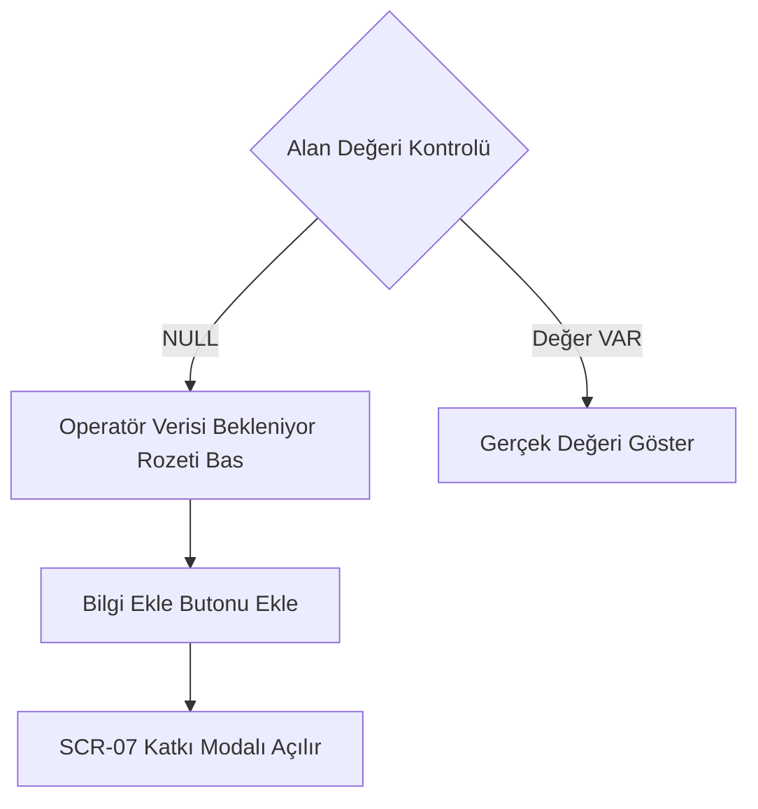

# Ekran Envanteri ve Arayüz Spesifikasyonu: elektriklioto.com (Faz 1)

> **Belge Sürümü:** 1.0.0-faz1  
> **Durum:** Onaylandı (UI/UX Karar Dokümanı)  
> **Rol:** UI/UX & Deneyim Tasarımı  
> **Kapsam:** Nuxt 3 Web ve Flutter Mobil Ortak Ekran Envanteri, Veri Alanları, Arayüz Durumları ve Etkileşim Kuralları  
> **Doğruluk Kaynakları:** `proje_kapsami.md`, `workspace/docs/teknik_mimari_dokumani.md`, `workspace/docs/backlog.md`, `workspace/docs/kabul_kriterleri.md`, `workspace/docs/veri_kaynagi_epdk.md`, `workspace/docs/ux_akislari.md`

---

## 1. Zorunlu Kısıtlar, Çatışmalar ve Varsayımlar

Aşağıdaki kısıtlar arayüz tasarımının değiştirilemez temelleridir; tüm ekranlar bu sınırlar üzerinde modellenir:

- **Alan Adı ve Marka:** `elektriklioto.com` tüm web, API (`api.elektriklioto.com`) ve mobil varlıkların tek çatısıdır (zorunlu).
- **Web Çatısı:** Nuxt.js / Vue.js (SSR/SSG uyumlu) Fastify API'sini tüketir (zorunlu).
- **Mobil İstemci:** Flutter ile geliştirilecektir; iOS ve Android için tek kod tabanı kullanılır (zorunlu).
- **Backend Çatısı:** Node.js / TypeScript üzerinde Fastify framework (zorunlu).
- **Veritabanı:** `postgis/postgis:16-3.4` Docker konteyneri üzerinde çalışır (zorunlu).
- **Lisans Sınırı:** Platform hiçbir aşamada "Lisanslı Şarj Operatörü" statüsü alamaz; EPDK elektrik satışı ve faturalama yapamaz; e-Mobilite Asistanı / EMP adayıdır (zorunlu).
- **Konum Gizliliği ve KVKK:** Kullanıcı GPS konumu sunucuda saklanamaz; yalnızca istemcide anlık harita merkezleme için geçici (in-memory) işlenir, geçmiş koordinat tutulamaz (zorunlu).
- **Tasarım Bütünlüğü:** `tasarim_sistemi.md` token'ları tek kaynaktır; Nuxt CSS ve Flutter Dart çıktıları tek derleme betiğiyle senkronize edilir; arayüz geliştirici görsel karar veremez (zorunlu).
- **Erişilebilirlik Tabanı:** WCAG 2.1 AA tabandır; metin kontrastı ≥ 4.5:1, dokunma hedefleri webde ≥ 44x44 CSS px, mobilde ≥ 48x48 pt olmalıdır (zorunlu).
- **Tohum Veri:** EPDK 16.788 istasyon ve 179 marka içeren `istasyonlar.json` kanonik çapadır (`ŞRJ/xxxx`); `lat`/`lon` mevcut kabul edilir, geocoding yapılmaz (zorunlu).
- **Eksik Veri Modeli:** Soket tipi, güç, tarife ve canlı doluluk verisi Faz 1 başlangıcında YOKTUR; şema bu alanları `NULL` kabul eder; arayüz boşken de anlamlı görünmek zorundadır; uydurma veri girilemez (zorunlu).

> **ÇATIŞMA:** "Mobil istemci Flutter ile geliştirilecektir. (zorunlu)" kısıtı teknik olarak imkânsızdır. Ortam raporunda `flutter` ve `dart` komutları "Exec format error" nedeniyle BOZUK durumdadır. İstemcinin geliştirilebilmesi için onarım gereklidir.

> **ÇATIŞMA:** "Paket yöneticisi tekliği: Ortamda pnpm 10.20.0 ölçülmüştür" kısıtı ortam gerçeğiyle uyuşmamaktadır. Güncel ortam raporunda `pnpm` YOK olarak listelenmiştir. Paylaşımlı workspace mimarisi için KURULUM GEREKİYOR: pnpm.

> **Varsayım:** Flutter ve pnpm ortam sorunları giderilene kadar web ve backend süreçleri Node v22 ve npm ile yürütülür; ekran envanteri her iki platformun mimari ve sözleşme gereksinimlerini eksiksiz karşılar.

> **Varsayım:** Soket tipi, güç, tarife ve anlık doluluk Faz 1 EPDK veri setinde bulunmadığından, bu alanlar ekranlarda "Operatör Verisi Bekleniyor" nötr rozetiyle gösterilir ve tıklandığında kitle kaynaklı katkı formunu tetikler.

---

## 2. Bilgi Mimarisi ve Gezinme Yapısı

### 2.1. Web URL Hiyerarşisi (Nuxt 3 SSR/SSG & Client-Only)
- `/` : Ana sayfa ve tam ekran interaktif vektör harita (`<ClientOnly>`).
- `/{city}/sarj-istasyonlari` : İl bazlı istasyon dizini (SSR/ISR, örn: `/istanbul/sarj-istasyonlari`).
- `/{city}/{district}/sarj-istasyonlari` : İlçe bazlı istasyon dizini (SSR/ISR, örn: `/istanbul/kadikoy/sarj-istasyonlari`).
- `/{operator}` : Operatör marka sayfası ve istasyon listesi (SSR, örn: `/zes`).
- `/{operator}/{slug}` : Kanonik istasyon detay sayfası (SSR + Schema.org JSON-LD).
- `/r/{base64_payload}` : Web-mobil rota aktarım köprüsü ve mobil indirme sayfası.
- `/hakkimizda` : Yasal EMP statüsü, KVKK bildirimleri ve EPDK veri kaynak beyanı.

### 2.2. Mobil Gezinme Yapısı (Flutter)
- **Alt Sekmeler:** Sekme 1: Harita (Keşfet/Arama/Filtre/FAB); Sekme 2: Favoriler (Çevrimdışı); Sekme 3: Katkı (Bildirim geçmişi); Sekme 4: Ayarlar (Tema/Önbellek/Yasal).
- **Modallar / Çekmeceler:** `StationDetailSheet` (3 kademeli: 160pt/380pt/Full), `IssueReportModal` (50m fence), `ContributeDataModal` (Veri tamamlama), `QrScanSheet` (Rota tarama).

### 2.3. Web ve Mobil Platform Karşılaştırma Matrisi

| Ekran Kodu | Ekran Adı | Web (Nuxt 3) | Mobil (Flutter) | Platform Kararı ve Yerleşim Farkı |
|---|---|:---:|:---:|---|
| **SCR-01** | İnteraktif Harita | Var (`/`) | Var (Sekme 1) | Web'de sol yan panel (380px) + harita; Mobilde tam ekran harita + FAB + alt çekmece. |
| **SCR-02** | İstasyon Detayı | Var (`/{operator}/{slug}`) | Var (`StationDetailSheet`) | Web'de SSR sayfa veya yan panel; Mobilde 3 kademeli bottom sheet. |
| **SCR-03** | SEO İl/İlçe Dizinleri | Var (SSR/ISR) | Yok | Web'e özgü; SEO trafiği çeker, haritaya sınır kutusuyla aktarır. |
| **SCR-04** | Operatör Kataloğu | Var (`/{operator}`) | Yok | Web'e özgü; 179 markanın dizini; mobilde filtre olarak yer alır. |
| **SCR-05** | Rota / İstasyon Köprüsü | Var (`QrBridgeModal`) | Var (`QrScanSheet`) | Web dinamik QR üretir; Mobil okuyup rota durumuna (state) yükler. |
| **SCR-06** | Arıza Bildirim Modalı | Var (Kısıtlı GPS) | Var (Donanım GPS) | Web'de konum izni yoksa pasif; Mobilde 50m donanım GPS fence ile aktif. |
| **SCR-07** | Topluluk Katkı Modalı | Var (Modal) | Var (Alt Çekmece) | Eksik soket/güç tamamlama formu; her iki platformda anonim imzayla çalışır. |
| **SCR-08** | Favoriler Ekranı | Var (Yan Çekmece) | Var (Sekme 2) | Web'de localStorage; Mobilde Hive NoSQL çevrimdışı önbellek destekli. |
| **SCR-09** | Ayarlar & Tema | Var (Header/Footer) | Var (Sekme 4) | Web'de çerez (FOUC korumalı); Mobilde SharedPreferences. |
| **SCR-10** | 404 / Bulunamadı | Var (`/404`) | Var (Dialog) | Web'de özel SSR hata sayfası; Mobilde harita bildirim diyaloğu. |

---

## 3. Harita Etkileşim ve Bileşen Davranış Modeli

- **BBox Sorgu Döngüsü:** Harita hareketi bittiğinde (debounce: 300ms) sınır kutusu (`bbox=min_lon,min_lat,max_lon,max_lat`) API'ye gönderilir (`GET /api/v1/stations`). Ham GPS konumu sunucuya iletilmez (in-memory kalır).
- **Sunucu Tabanlı Kümeleme:** `Zoom < 11`: PostGIS `ST_SnapToGrid` ile kümelenmiş daire pinler (`cluster_count`) döner; dokunulduğunda harita merkeze zoom yapar (`zoom: 12`). `Zoom ≥ 11`: Tekil istasyon pinleri render edilir (operatör amblemi/rengi).
- **Pin Seçim Durumu:** Seçilen pin %15 büyür ve 2px odak halkası (`border-primary`) alır. Web'de sol yan panel (380px), mobilde `StationDetailSheet` (Peek: 160pt) açılır.
- **Filtre Çubuğu Davranışı:**
  1. `Operatörler (179 Marka)`: Çoklu seçim açılır menüsü (Aktif).
  2. `Hizmet Şekli`: `Halka Açık` / `Özel` anahtarı (Aktif).
  3. `Hızlı Şarj (DC)`: Pasif buton. > **VERİ YOK:** Şarj Gücü (kW). Dokunulduğunda "Operatör Verisi Bekleniyor" toast'ı çıkar.
  4. `Boş Soketler`: Pasif buton. > **VERİ YOK:** Anlık Doluluk Durumu. Dokunulduğunda kısıtlı arama uyarısı verilir.

---

## 4. Detaylı Ekran Envanteri

### SCR-01: İnteraktif Harita ve Ana Keşfet Ekranı
- **Platform:** Web (`/`), Mobil (`ExploreTab` - Sekme 1)
- **Amaç:** 16.788 şarj istasyonunu akıcı (60 FPS) haritada sunmak, filtrelemek ve en yakın istasyona odaklanmak.
- **Bağlantı:** `US-04`, `US-09`, `US-11` | `PO-201`, `PO-502`, `PO-601`
- **Veri Alanları:** `station_pins` (`id`, `lat`, `lon`, `operator.slug`); `cluster_pins` (`cluster_id`, `count`, `center_geom`); `operator_filter_list` (179 marka); `service_type` (`Halka Açık`/`Özel`); `power_kw_filter` (> **VERİ YOK:** Şarj Gücü (kW)); `occupancy_filter` (> **VERİ YOK:** Anlık Doluluk Durumu); `user_location` (In-memory GPS).
- **Kullanıcı Eylemleri:** Pan/zoom; pine dokunma (SCR-02 açar); kümeye dokunma (zoom 12); operatör filtreleme (< 200ms); konumuma git FAB'ı; arama çubuğu.
- **Arayüz Durumları:**
  - *Yükleniyor:* Sağ üstte spinner; mevcut pinler korunur.
  - *Boş:* "Bu alanda şarj istasyonu bulunamadı. Haritayı kaydırın."
  - *Hata:* Webde "Yeniden Dene" butonu; Mobilde Hive önbelleği ve "Çevrimdışı Mod" bandı.
  - *Eksik Veri:* Güç ve doluluk filtreleri kilitli pasif render edilir.

---

### SCR-02: İstasyon Detay Görünümü (Panel / Sayfa / Çekmece)
- **Platform:** Web (`/{operator}/{slug}` ve Sol Panel 380px), Mobil (`StationDetailSheet` 3 Kademeli Çekmece)
- **Amaç:** İstasyonun adres, operatör ve EPDK sicil no bilgilerini sunmak; şarj başlatma için CPO uygulamasına derin bağlantı (deep-link) sağlamak.
- **Bağlantı:** `US-06`, `US-07`, `US-12`, `US-18` | `PO-301`, `PO-401`, `PO-1001`
- **Veri Alanları:** `station_name`; `istasyon_no` (`ŞRJ/xxxx` kanonik kimlik); `operator_name` (Ad ve logo); `address`, `city`, `district`; `service_type` (`Halka Açık`/`Özel`); `socket_types` (> **VERİ YOK:** Soket Tipi); `power_kw` (> **VERİ YOK:** Şarj Gücü (kW)); `current_tariff` (> **VERİ YOK:** Canlı Tarife / Fiyat); `occupancy_status` (> **VERİ YOK:** Anlık Doluluk Durumu); `updated_at` (Tazelik damgası); `issue_badge` (3+ doğrulanmış bildirimde "Arızalı / Riskli" rozeti).
- **Kullanıcı Eylemleri:**
  - *Operatörde Aç / Şarja Başla (Birincil CTA):* CPO uygulaması varsa doğrudan açar (`zes://station/{no}`); yoksa mağazaya yönlendirir; desteklenmiyorsa kodu panoya kopyalar (`clipboard_fallback`), toast gösterir ve linki açar.
  - *Telefona Aktar (Web):* SCR-05 QR modalını açar; *Yol Tarifi Al:* Harici haritayı açar; *Arıza Bildir:* SCR-06'yı açar; *Bilgi Ekle (CTA):* SCR-07'yi açar; *Favoriye Ekle:* Cihaz listesine kaydeder.
- **Arayüz Durumları:**
  - *Yükleniyor:* İskelet (shimmer) animasyonu.
  - *Boş/Eksik Veri:* Soket, güç ve tarifede nötr gri `Operatör Verisi Bekleniyor` rozeti + `Bilgi Ekle` butonu; dolulukta "Canlı durum verisi henüz açılmadı" metni.
  - *Hata:* Webde 404 sayfası; mobilde "İstasyon bulunamadı" diyaloğu.
  - *Bayat Veri (> 24 Saat):* Kart tepesinde: "Son Güncelleme: X gün önce (EPDK Sicil Verisi)".

---

### SCR-03: SEO İl ve İlçe İstasyon Dizin Sayfaları
- **Platform:** Web'e Özgü (`/{city}/sarj-istasyonlari`, `/{city}/{district}/sarj-istasyonlari` - Nuxt SSR/ISR)
- **Amaç:** Arama motorlarından gelen kullanıcılara hızlı (FCP < 1.2s, SEO ≥ 90) dizin sunmak, schema.org JSON-LD ile indekslenmek ve haritaya sevk etmek.
- **Bağlantı:** `US-08` | `PO-501`
- **Veri Alanları:** `page_title` (`"{İlçe} {İl} Elektrikli Araç Şarj İstasyonları"`); `station_count`; `station_cards` (`istasyon_adi`, `operator.name`, `adres`, `istasyon_no`); `json_ld_schema` (Schema.org metadata); `district_bbox` (Sınır koordinatları); `socket_summary` (> **VERİ YOK:** Soket Tipi ve Güç Dağılımı).
- **Kullanıcı Eylemleri:** "Haritada Gör" (`district_bbox` ile haritayı açar); karta tıklama (SCR-02'ye yönlendirir); breadcrumb; marka filtreleme.
- **Arayüz Durumları:**
  - *Yükleniyor:* SSR ile hazır HTML (shimmer yok).
  - *Boş:* "Bu ilçede kayıtlı şarj istasyonu bulunmamaktadır."
  - *Hata:* Geçersiz il/ilçede HTTP 404 ve SCR-10 sayfası.
  - *Eksik Veri:* Kartlarda güç/tarife sütunu yer almaz; `Operatör Verisi Bekleniyor` rozeti basılır.

---

### SCR-04: Operatör Marka Rehberi ve İstasyon Kataloğu
- **Platform:** Web'e Özgü (`/{operator}` - Nuxt SSR)
- **Amaç:** EPDK lisanslı 179 markanın unvanını, istasyon ağını ve il dağılımını sunarak kurumsal SEO otoritesi sağlamak.
- **Bağlantı:** `US-07`, `US-08` | `PO-102`, `PO-501`
- **Veri Alanları:** `operator_name` (Ad ve logo); `license_holder` (`sarj_agi_isletmecisi` unvanı); `total_station_count`; `city_distribution` (İl dağılımı); `station_list` (Kanonik liste); `deep_link_status`; `average_power_kw` (> **VERİ YOK:** Ortalama Şarj Gücü (kW)).
- **Kullanıcı Eylemleri:** "Ağ Haritasını Aç" (`?operator={slug}` ile harita açar); il bazlı süzme; operatör uygulama indirme linkleri.
- **Arayüz Durumları:**
  - *Yükleniyor:* SSR ile hazır HTML.
  - *Boş:* "Bu operatöre ait aktif istasyon kaydı bulunamadı."
  - *Hata:* Tanımsız operatörde HTTP 404 sayfası.
  - *Eksik Veri:* Fiyat/güç istatistikleri gizlenir; "Tarife bilgisi için ilgili operatöre başvurunuz" uyarısı verilir.

---

### SCR-05: Web-Mobil Rota & İstasyon Aktarım Köprüsü (QR Kod)
- **Platform:** Web (`QrBridgeModal`), Mobil (`QrScanSheet` ve `/r/{base64}`)
- **Amaç:** Web'de incelenen istasyon veya rotanın, hesap açma ve sunucuda güzergah saklama zorunluluğu olmadan (sıfır hesap/KVKK) mobil uygulamaya aktarılması.
- **Bağlantı:** `US-10` | `PO-801`
- **Veri Alanları:** `station_uids` (Durak listesi); `route_url` (`https://elektriklioto.com/r/{base64}`); `qr_code_svg` (256x256 SVG matrisi); `target_device` (iOS/Android akıllı banner için).
- **Kullanıcı Eylemleri:** Kamera ile QR okuma (mobil); bağlantıyı kopyalama (web); uygulamayı aç / indir yönlendirmesi.
- **Arayüz Durumları:**
  - *Yükleniyor:* QR üretim süresi < 100ms.
  - *Başarı:* Kod okunduğunda mobil haritada rota state'e yüklenir, modal kapanır.
  - *Hata:* Kamera izni engellendiğinde uyarı; bozuk payload'da "Geçersiz rota bağlantısı" toast'ı.

---

### SCR-06: Kitle Kaynaklı Arıza Bildirim Modalı (Proximity Proof)
- **Platform:** Web (Kısıtlı - Tarayıcı GPS izniyle), Mobil (`IssueReportModal` - Donanım GPS)
- **Amaç:** İstasyon arızalarını veya ICEing durumlarını, sunucuya hiçbir GPS koordinatı göndermeden (sıfır konum saklama) bildirmek.
- **Bağlantı:** `US-14`, `US-15` | `PO-701`, `PO-702`
- **Veri Alanları:** `station_id`; `issue_type` (`STATION_OFFLINE`, `CABLE_DAMAGED`, `ICEING`, `ACCESS_BLOCKED`); `device_distance` (Lokal hesaplanır, Sunucuya ASLA GÖNDERİLMEZ); `proximity_proof` (Mesafe < 50m HMAC-SHA256 kanıtı); `user_coordinates` (> **VERİ YOK:** Sunucuda Saklanan Kullanıcı Konumu (KVKK Kısıtı)).
- **Kullanıcı Eylemleri:** Arıza türü seçimi; opsiyonel 140 karakter açıklama; "Konumu Doğrula ve Gönder" butonu.
- **Arayüz Durumları:**
  - *Doğrulanıyor:* "Mesafe doğrulanıyor..." spinner'ı.
  - *Mesafe Dışı (> 50m):* Kırmızı uyarı: "Bildirim için istasyona 50m yakınında olmalısınız. (Mevcut: ~{X}m)." Form kilitlenir.
  - *Başarı:* Onay toast'ı: "Bildiriminiz alındı. Katkınız için teşekkürler!"
  - *Hız Sınırı:* Dakikada 5+ bildirimde HTTP 429: "Çok fazla istek. Lütfen bekleyin."

---

### SCR-07: Topluluk İstasyon Verisi Katkı Modalı (Eksik Veri Tamamlama)
- **Platform:** Web ve Mobil Ortak (`ContributeDataModal`)
- **Amaç:** EPDK veri setinde bulunmayan soket tipi ve güç (kW) verilerini sürücü katkısıyla toplamak ve moderasyon kuyruğuna iletmek.
- **Bağlantı:** `US-06` | `PO-301`
- **Veri Alanları:** `station_id`; `selected_socket` (`CCS`, `Type 2`, `CHAdeMO`); `estimated_power` (`22 kW`, `60 kW`, `120 kW+`, `Bilmiyorum`); `price_note` (TL/kWh, opsiyonel); `plate_photo` (Etiket fotoğrafı, opsiyonel).
- **Kullanıcı Eylemleri:** Soket tipi ve güç seçimi; etiket fotoğrafı yükleme; anonim imzalı gönderim.
- **Arayüz Durumları:**
  - *Yükleniyor:* Gönder butonu pasif ve spinner aktif.
  - *Başarı:* Modal kapanır: "Veri katkınız moderasyon kuyruğuna iletildi."
  - *Hata:* "Bağlantı hatası. Tekrar deneyin."

---

### SCR-08: Favori İstasyonlar Ekranı (Çevrimdışı Destekli)
- **Platform:** Web (`FavoritesDrawer`), Mobil (`FavoritesTab` - Sekme 2)
- **Amaç:** Sık kullanılan istasyonlara hızlı erişim; hücresel ağ yokken dahi önbellekten adres ve koordinat sunmak.
- **Bağlantı:** `US-13`, `US-15` | `PO-602`, `PO-702`
- **Veri Alanları:** `favorite_stations` (Hive/localStorage listesi); `station_status` (Son durum veya "Arızalı / Riskli" rozeti); `sync_timestamp`; `cloud_sync_state` (> **VERİ YOK:** Çoklu Cihaz Bulut Senkronizasyonu (Faz 1'de cihaz yerelindedir)).
- **Kullanıcı Eylemleri:** Karta tıklama (haritada odaklar); swipe ile listeden silme; yol tarifi başlatma.
- **Arayüz Durumları:**
  - *Yükleniyor:* 3 satırlık iskelet yükleyici.
  - *Boş:* "Henüz favori istasyon eklemediniz. Haritadan yıldız ikonuna dokunun."
  - *Çevrimdışı:* Liste kesintisiz açılır; kart altında "Çevrimdışı Önbellek Verisi" rozeti basılır.

---

### SCR-09: Uygulama Ayarları, Tema ve Çevrimdışı Durum Ekranı
- **Platform:** Web (Header/Footer Menüsü), Mobil (`SettingsTab` - Sekme 4)
- **Amaç:** Gece/gündüz tema tercihi (FOUC'suz), çevrimdışı önbellek temizleme ve yasal EMP statüsü beyanı.
- **Bağlantı:** `US-09`, `US-13` | `PO-502`, `PO-602`
- **Veri Alanları:** `theme_preference` (`SYSTEM`, `LIGHT`, `DARK`); `cache_size` (örn: `14.2 MB`); `legal_disclaimer` (Yasal EMP statüsü ve EPDK beyanı); `app_version` (`v1.0.0-faz1 (build 102)`).
- **Kullanıcı Eylemleri:** Tema değiştirme (Açık/Koyu/Sistem); önbelleği temizleme; KVKK ve Kullanım Şartları metinlerini açma.
- **Arayüz Durumları:**
  - *Tema Geçişi:* 200ms yumuşak geçiş; web SSR'da FOUC parlama süresi tam olarak 0ms.

---

### SCR-10: 404 Sayfası ve Bulunamadı Durumları
- **Platform:** Web (`/404` Nuxt SSR Sayfası), Mobil (`NotFoundDialog` / `EmptyStateView`)
- **Amaç:** Geçersiz veya silinmiş bağlantılarda kullanıcıya güvenli çıkış ve haritaya dönüş yolu sunmak.
- **Bağlantı:** `US-08` | `PO-501`
- **Veri Alanları:** `error_code: 404`, `error_message`, `suggested_links` (İstanbul, Ankara, İzmir rehberleri).
- **Kullanıcı Eylemleri:** "Haritaya Dön" birincil CTA'sı; arama kutusunu açma.

---

## 5. Eksik Veri ve "VERİ YOK" Arayüz Kural Seti

Faz 1'de EPDK veri setinde bulunmayan alanlar için aşağıdaki kurallar **istisnasız zorunludur**:

1. **Uydurma Veri Yasağı:** Soket tipi, güç (kW), canlı tarife (TL/kWh) ve anlık doluluk için kesinlikle `22kW`, `0.00 TL` veya `Boş` gibi mock değerler YAZILAMAZ.
2. **Görsel Dil Standardı:** İlgili alan kartta tamamen gizlenmez. Alanın yerine `tasarim_sistemi.md` nötr gri token'ı ile `Operatör Verisi Bekleniyor` rozeti ve hemen yanında `Bilgi Ekle` butonu (dokunma hedefi ≥ 44x44px) gösterilir.
3. **Filtre Kısıtlaması:** Harita filtre çubuğundaki "Hızlı Şarj (DC)" ve "Boş Soketler" filtreleri pasif (disabled) durumda render edilir; tıklandığında *"Operatör Verisi Bekleniyor - Bu filtre yakında aktifleşecektir"* uyarısı verilir.

---

## 6. Erişilebilirlik (A11y) ve Tasarım Token Uyumluluk Kapısı

Tüm ekran tasarımları ve üretilecek bileşen kodları aşağıdaki kalite kapılarına uymak zorundadır:

1. **Dokunma Hedefleri:** Web'de tüm etkileşimli öğeler en az **44x44 CSS pikseli** (`min-h-[44px] min-w-[44px]`), mobilde en az **48x48 pt** olmalıdır.
2. **Kontrast Oranları (WCAG 2.1 AA):** Gövde metinleri arka plana karşı en az **4.5:1**, büyük başlıklar ve buton metinleri en az **3.0:1** kontrast oranına sahip olmalıdır.
3. **Tasarım Token Uyumu:** Renk HEX kodları (`#xxxxxx`), boşluklar ve köşe yarıçapları doğrudan `tasarim_sistemi.md` token'larından gelmelidir; keyfi değerler yazılamaz, eksikler `// TASARIM EKSİĞİ:` olarak işaretlenir.
4. **Sıfır Konum Saklama Denetimi:** Hiçbir formda veya API çağrısında kullanıcı koordinatını kalıcıya yazacak girdi bulunamaz.
