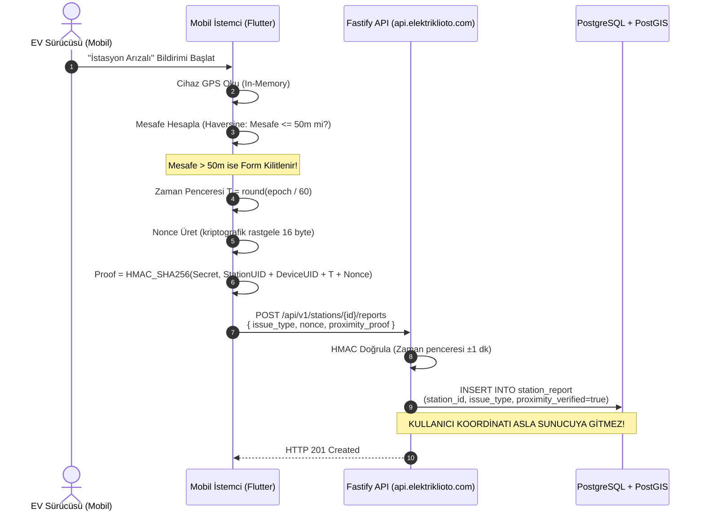

# Güvenlik Tasarımı: elektriklioto.com (Faz 1)

> **Belge Sürümü:** 1.0.0-faz1  
> **Durum:** Onaylandı (Teknik Güvenlik ve Mimari Karar Dokümanı)  
> **Hazırlayan:** Güvenlik ve Tehdit Modelleme Rolü  
> **Doğruluk Kaynakları:** `proje_kapsami.md`, `workspace/docs/teknik_mimari_dokumani.md`, `workspace/docs/paket_secim_raporu.md`, `workspace/docs/backlog.md`

---

## 1. Yönetici Özeti ve Güvenlik Vizyonu

`elektriklioto.com` (Faz 1); elektrikli araç sürücülerine Türkiye genelindeki şarj istasyonlarını harita üzerinden sunan, operasyonel derin bağlantılar (deep-link) kuran bir e-Mobilite Asistanı ve Bilgi Hub'ıdır. 

Sistemin güvenlik vizyonu şu üç temel ilkeye dayanır:
1. **Tasarım Gereği Gizlilik (Privacy by Design):** Kullanıcıların GPS koordinatları sunucuda asla depolanmaz (Sıfır Konum Saklama). Kitle kaynaklı doğrulamalar kriptografik mesafe kanıtı (`proximity_proof`) ile istemci tarafında çözümlenir.
2. **Asgari Yüzey ve Anonimlik:** Arama, harita görüntüleme ve filtreleme sıfır kimlik doğrulamasıyla çalışır; bildirim ve favori işlemleri cihaz kanıtı (device attestation) tabanlı anonim belirteçlerle yürütülür.
3. **Yasal Lisans Sınırı Savunması:** Sistemin lisanslı şarj operatörü veya ödeme kuruluşu algılanmasını engelleyen mimari bariyerler uygulanır; faturalama, doğrudan şarj başlatma ve ödeme uç noktaları kesinlikle barındırılmaz.

---

## 2. Zorunlu Kısıtlar, Çatışmalar ve Varsayımlar

Güvenlik mimarisinin üzerine inşa edildiği zorunlu ilkeler:
- **Alan Adı ve Marka:** `elektriklioto.com` tüm web, API (`api.elektriklioto.com`) ve mobil varlıkların tek çatısıdır (zorunlu).
- **Web Çatısı:** Nuxt.js / Vue.js (SSR/SSG uyumlu) Fastify API'sini tüketir (zorunlu).
- **Mobil İstemci:** Flutter ile geliştirilecektir; iOS ve Android için tek kod tabanı kullanılır (zorunlu).
- **Backend Çatısı:** Node.js / TypeScript üzerinde Fastify framework (zorunlu).
- **Veritabanı:** `postgis/postgis:16-3.4` Docker konteyneri üzerinde çalışır; `docker-compose.yml` ile yönetilir (zorunlu).
- **Lisans Sınırı:** Platform hiçbir aşamada "Lisanslı Şarj Operatörü" statüsü alamaz; EPDK elektrik satışı ve faturalama yapamaz; e-Mobilite Asistanı / EMP adayıdır (zorunlu).
- **Konum Gizliliği ve KVKK:** Kullanıcı GPS konumu sunucuda saklanamaz; yalnızca istemcide anlık harita merkezleme için geçici (in-memory) işlenir, geçmiş koordinat tutulamaz (zorunlu).
- **Şema Göçü:** Üretimde elle DDL yasaktır; yalnızca sürümlenmiş migration dosyaları kullanılır (zorunlu).
- **Tasarım Bütünlüğü:** `tasarim_sistemi.md` token'ları tek kaynaktır; Nuxt CSS ve Flutter Dart çıktıları tek derleme betiğiyle senkronize edilir (zorunlu).
- **Tohum Veri:** EPDK 16.788 istasyon ve 179 marka içeren `istasyonlar.json` kanonik çapadır (`ŞRJ/xxxx`); `lat`/`lon` mevcut kabul edilir, geocoding yapılmaz (zorunlu).
- **Eksik Veri Modeli:** Soket tipi, güç, tarife ve canlı doluluk Faz 1 başlangıcında `NULL` kabul edilir; sistem bu alanlar boşken çalışacak şekilde modellenir (zorunlu).

> **ÇATIŞMA:** "Mobil istemci Flutter ile geliştirilecektir. (zorunlu)" kısıtı teknik olarak imkânsızdır. Ortam raporunda `flutter` ve `dart` komutları "Exec format error" nedeniyle BOZUK durumdadır. İstemcinin geliştirilebilmesi için onarım gereklidir.

> **ÇATIŞMA:** "Paket yöneticisi tekliği: Ortamda pnpm 10.20.0 ölçülmüştür" kısıtı ortam gerçeğiyle uyuşmamaktadır. Güncel ortam raporunda `pnpm` YOK olarak listelenmiştir. Paylaşımlı workspace mimarisi için KURULUM GEREKİYOR: pnpm.

> **Varsayım:** Flutter ve pnpm ortam onarımları tamamlanana kadar güvenlik tasarımı; Node.js v22 LTS, Fastify v5, Nuxt 3 ve mobil işletim sistemi güvenlik standartlarına (iOS DeviceCheck/App Attest, Android Play Integrity) tam uyumlu kurgulanmıştır.

---

## 3. Kimlik Doğrulama ve Oturum Mimarisi (Authentication)

### 3.1. Anonim Öncelikli Cihaz Kaydı (Anonymous Device Attestation)
- **Karar:** Harita arama, istasyon listeleme ve filtreleme için oturum açma zorunluluğu yoktur (Public Access). Favori ekleme ve kitle kaynaklı arıza bildirimi için Apple App Attest (iOS) ve Google Play Integrity (Android) donanım kanıtı üzerinden üretilen anonim `device_token` kullanılır.
- **Gerekçe:** Kullanıcıdan gereksiz kişisel veri (e-posta, telefon, ad-soyad) toplanmasını engelleyerek KVKK/GDPR veri minimizasyonu ilkesini yerine getirmek ve bot ihbarlarını engellemek.
- **Sonuç:** Sunucu `device` tablosunda yalnızca donanım imzasıyla doğrulanmış `device_uid` (UUIDv7), genel itibar skoru (`trust_score`) ve ilk kayıt tarihini tutar. Kişisel veri saklanmaz.
- **Alternatif:** *SMS OTP ile telefon doğrulaması:* Yüksek maliyet, kullanıcı sürtünmesi ve gereksiz KVKK sorumluluğu getirdiği için Faz 1'de reddedildi.

### 3.2. Opsiyonel Kullanıcı Oturumu (Opsiyonel E-posta Senkronizasyonu)
- **Karar:** Cihazlar arası favori senkronizasyonu veya push bildirim izni isteyen kullanıcılar için e-posta tabanlı şifresiz oturum (Magic Link) sunulur. Şifre saklanmaz.
- **Gerekçe:** Şifre sızıntısı (credential stuffing, brute-force) riskini sıfıra indirmek ve minimum kişisel veriyle güvenli oturum sağlamak.
- **Sonuç:** Kullanıcıya 15 dakika geçerli, tek kullanımlık kriptografik oturum linki iletilir. Doğrulama sonrası RFC 7519 uyumlu JWT üretilir.
- **Alternatif:** *OAuth / Sosyal Giriş (Google/Apple Sign-In):* Faz 1 kapsamında ek bağımlılık ve gizlilik sözleşmesi karmaşıklığı oluşturduğu için Faz 2'ye bırakıldı.

### 3.3. Belirteç (Token) Yaşam Döngüsü ve Saklama Politikası
- **Karar:** 
  - **Access Token:** Kısa ömürlü (15 dakika), Ed25519 (EdDSA) ile imzalanmış JWT. Fastify API tarafından durumsuz (stateless) doğrulanır.
  - **Refresh Token:** Uzun ömürlü (30 gün), veritabanında `sha256` özetiyle saklanan tek kullanımlık (rotating) belirteç.
- **İstemci Saklama Kuralı:**
  - **Web (Nuxt 3):** Belirteçler JavaScript tarafından erişilemeyen `__Host-` önekli `HttpOnly; Secure; SameSite=Strict; Path=/` çerezlerinde saklanır. XSS saldırılarında token hırsızlığı önlenir.
  - **Mobil (Flutter):** `flutter_secure_storage` aracılığıyla iOS Keychain ve Android Keystore donanım şifreleme katmanında saklanır. `Hive` veya `SharedPreferences` içine asla düz metin token yazılmaz.
- **Alternatif:** *Web'de localStorage kullanımı:* XSS zafiyetinde belirtecin doğrudan çalınabilmesi nedeniyle kesinlikle yasaklandı.

---

## 4. Yetkilendirme ve Erişim Kontrolü (Authorization & RBAC)

### 4.1. Rol ve İzin Matrisi
Fastify katmanında her rota için `@fastify/auth` veya özel route hook'ları ile bildirimsel yetkilendirme uygulanır.

| Rol | Tanım | Yetkiler | Kimlik Doğrulama Şartı |
|---|---|---|---|
| **Anonymous User** | Web veya mobil anonim ziyaretçi | `stations:read`, `operators:read`, `route:decode` | Yok |
| **Attested Device** | Donanım kanıtı onaylı mobil cihaz | `favorites:write`, `reports:create (proximity required)` | Geçerli `X-Device-Attestation` başlığı |
| **Registered User** | E-posta doğrulamış kullanıcı | `favorites:sync`, `profile:manage`, `reports:create` | Geçerli `Bearer <JWT>` |
| **System Worker** | Arka plan veri toplayıcı süreç | `queue:consume`, `stations:sync`, `health:write` | Karşılıklı TLS (mTLS) veya Dahili Servis Anahtarı |
| **Operator Admin** | Dahili operasyon personeli | `reports:moderate`, `operators:manage`, `system:read` | MFA zorunlu Admin JWT |

### 4.2. Fastify Yetkilendirme Kancaları (Route Pre-Handlers)
- **Kural:** Tüm korumalı uç noktalarda `preHandler: [verifyAttestation, verifyAuth]` zinciri işletilir.
- **Kural:** Yetkisiz erişimlerde (`401 Unauthorized`) ve yetki yetersizliğinde (`403 Forbidden`) standart RFC 7807 Problem Details JSON formatı dönülür. Sistem mimarisi ve iç hata detayları yanıta sızdırılamaz.

---

## 5. KVKK / GDPR Uyum ve Konum Gizliliği (Privacy by Design)

### 5.1. Sıfır Konum Saklama (Zero-Storage Architecture)
Zorunlu KVKK kısıtı gereğince, kullanıcının anlık veya geçmiş GPS koordinatları sunucu tarafında hiçbir koşulda diske, veritabanına veya kalıcı loglara yazılamaz:
- **Harita Arama:** İstemci haritayı kaydırdığında ham GPS koordinatı iletmez; harita görünümünün sınır kutusunu iletir (`bbox=min_lon,min_lat,max_lon,max_lat`). Sunucu kullanıcının o kutu içinde tam olarak nerede durduğunu bilemez.
- **Log Filtreleme:** Fastify erişim loglarında `bbox`, `lat`, `lon` gibi coğrafi parametreler ile istemci IP adresleri maskelenir veya log satırından çıkartılır.

### 5.2. Kriptografik Konum Doğrulama Protokolü (Proximity Proof)
Kitle kaynaklı arıza bildirimlerinde "kullanıcının istasyona 50m yakınlıkta olması" şartı, ham konum verisi sunucuya iletilmeden kriptografik olarak kanıtlanır:



- **Protokol Güvenlik Kuralları:**
  1. `proximity_proof` yalnızca istemci belleğinde tutulan kısa ömürlü oturum anahtarı, `station_uid`, `device_uid`, zaman penceresi ve rastgele bir `nonce` kullanılarak `crypto` kütüphanesiyle (`HMAC-SHA256`) hesaplanır.
  2. Paket seçim raporuna tam uyumlu olarak:
     - Mobilde: `PAKET KULLAN: crypto ^3.0.6`
     - Backend'de: `node:crypto` yerel modülü kullanılır.
  3. `station_report` tablosunda `user_lat`, `user_lon`, `geom` veya `ip_address` sütunları **BULUNMAZ**. Yalnızca `proximity_verified: true` bayrağı tutulur.
  4. Kullanılmış `nonce` değerleri 5 dakika boyunca in-memory LRU önbelleğinde saklanır; aynı proof ile replay saldırısı yapılamaz.

### 5.3. Veri Saklama, Anonimleştirme ve İmha Politikası
- **`station_report` Tablosu:** 90 günden eski bireysel arıza bildirimleri aylık bölümleme (partitioning) üzerinden `DROP PARTITION` ile kalıcı olarak silinir. İstasyonun geçmiş istatistiği yalnızca toplam sayı ve arıza oranı olarak agregasyon tablosunda saklanır.
- **Geçici Kuyruk Verileri:** PostgreSQL `sys_job_queue` tablosunda başarıyla tamamlanan işler 24 saat içinde otomatik `DELETE` edilir.

---

## 6. Kötüye Kullanım, Hız Sınırlama ve Bot Savunması (Anti-Abuse)

### 6.1. Token-Bucket Hız Sınırlama Kuralları
Paket seçim raporunda onaylanan `PAKET KULLAN: @fastify/rate-limit ^10.2.0` kütüphanesi kullanılır. Hız limitleri IP ve anonim `device_token` bileşimine göre uygulanır.

| Uç Nokta Grubu | Metot & Yol | Limit (İstek / Zaman) | Aşım Yanıtı | Gerekçe |
|---|---|---|---|---|
| **Genel CBS Harita** | `GET /api/v1/stations*` | 120 req / 1 dk | HTTP 429 + `Retry-After` | Harita pan/zoom akışını desteklerken kazımayı (scraping) sınırlar |
| **İstasyon Detay** | `GET /api/v1/stations/:slug` | 60 req / 1 dk | HTTP 429 + `Retry-After` | Sayfa ziyaretlerini korur, toplu veri indirmeyi engeller |
| **Arıza Bildirimi** | `POST /api/v1/stations/:id/reports` | 5 req / 1 saat | HTTP 429 + `Retry-After` | Spam ihbar ve harita sabotajını engeller |
| **Rota Aktarım** | `GET /r/:payload` | 30 req / 1 dk | HTTP 429 + `Retry-After` | Rota QR çözümleme suistimalini önler |
| **Operatör Sözlüğü** | `GET /api/v1/operators*` | 60 req / 1 dk | HTTP 429 + `Retry-After` | Statik sözlük erişim koruması |

### 6.2. Shadow-Ban ve İtibar Skoru (Reputation Engine)
- **Tetiklenme:** Sürekli olarak doğrulanmamış (proximity proof başarısız) bildirim gönderen veya aşırı sıklıkta rapor açan cihazlar otomatik olarak şüpheli listesine alınır.
- **Çalışma Prensibi (Sessiz Engelleme):** 
  - Shadow-ban altındaki bir cihazdan gelen arıza bildirimlerine API normal `HTTP 201 Created` yanıtı döner.
  - Ancak veritabanına kayıt atılırken `is_suppressed: true` bayrağı basılır.
  - Bu bildirimler istasyonun haritadaki "Arızalı / Riskli" rozet algoritmasını ve arıza skorunu kesinlikle etkilemez.
  - Saldırgan, engellendiğini fark edemediği için yeni cihaz kimliği veya IP türetme ihtiyacı duymaz.

### 6.3. Web'den Mobil Rota Aktarımı Bütünlüğü (QR Payload Security)
- **Format:** `https://elektriklioto.com/r/{base64_payload}`
- **Payload Yapısı:** JSON formatında `{ version, stops: [station_uids], expires_at, sig }`
- **Kriptografik Bütünlük:** URL içeriğindeki veriler manipülasyona karşı sunucunun gizli anahtarı ile `HMAC-SHA256` üzerinden imzalanır (`sig`).
- **Doğrulama:** Mobil uygulama veya web çözücü, imza uyuşmazlığında veya `expires_at` (maksimum 48 saat) aşıldığında rotayı reddeder. Kişisel veri içermez, şifreli kimlik taşımaz.

---

## 7. Ağ, Taşıma ve Uygulama Katmanı Güvenliği

### 7.1. TLS/HTTPS ve Taşıma Güvenliği
- **Zorunlu HTTPS:** `elektriklioto.com` ve `api.elektriklioto.com` altındaki tüm trafik TLS 1.3 zorunluluğu ile çalışır (TLS 1.0 ve 1.1 tamamen devre dışıdır).
- **HSTS (HTTP Strict Transport Security):** Fastify yanıtlarında en az 1 yıl süreli HSTS başlığı zorunludur:  
  `Strict-Transport-Security: max-age=31536000; includeSubDomains; preload`

### 7.2. Güvenlik Başlıkları ve İçerik Güvenlik Politikası (CSP)
Paket seçim raporuna uygun olarak `PAKET KULLAN: @fastify/helmet ^13.0.0` entegre edilir.

```typescript
// Fastify Helmet Güvenlik Yapılandırması
fastify.register(helmet, {
  contentSecurityPolicy: {
    directives: {
      defaultSrc: ["'self'"],
      scriptSrc: ["'self'", "'wasm-unsafe-eval'"], // MapLibre WebGL desteği
      styleSrc: ["'self'", "'unsafe-inline'"],     // Nuxt SSR tema sınıfları
      imgSrc: ["'self'", "data:", "blob:", "https://*.elektriklioto.com"],
      connectSrc: [
        "'self'", 
        "https://api.elektriklioto.com", 
        "https://*.tiles.maplibre.org" // Harita karo sağlayıcıları
      ],
      fontSrc: ["'self'"],
      objectSrc: ["'none'"],
      baseUri: ["'self'"],
      formAction: ["'self'"],
      frameAncestors: ["'none'"], // Clickjacking koruması
      upgradeInsecureRequests: [],
    },
  },
  crossOriginEmbedderPolicy: false, // Harita tile/worker uyumu
  crossOriginOpenerPolicy: { policy: "same-origin" },
  crossOriginResourcePolicy: { policy: "same-site" },
  hidePoweredBy: true, // X-Powered-By: Fastify sızıntısını engeller
  noSniff: true,       // X-Content-Type-Options: nosniff
  xssFilter: true,     // X-XSS-Protection
});
```

### 7.3. Çapraz Kaynak Paylaşımı (CORS) Politikası
`PAKET KULLAN: @fastify/cors ^10.0.0` ile yalnızca izinli kaynaklar kabul edilir:
- **İzinli Web Kökenleri:** `https://elektriklioto.com`, `https://www.elektriklioto.com`, yerel geliştirme için `http://localhost:3000`.
- **Mobil İstemciler:** Native mobil uygulamalar tarayıcı CORS mekanizmasına tabi değildir; ancak `Origin` başlığı gönderildiğinde doğrulanır.
- **Yöntem Kısıtları:** Yalnızca `GET`, `POST`, `OPTIONS` izinlidir; `PUT`, `DELETE`, `PATCH` genel API'de kapalıdır.
- **Başlık Kısıtları:** Yalnızca `Content-Type`, `Authorization`, `X-Device-Attestation` kabul edilir.
- **Kimlik Bilgisi:** `credentials: true` yalnızca web domain'imiz için açıktır; wildcard (`*`) ile asla `credentials: true` birleştirilmez.

---

## 8. Veritabanı ve Altyapı Güvenliği

### 8.1. PostGIS İzolasyonu ve En Az Yetki (Least Privilege)
- **Konteyner İzolasyonu:** `postgis/postgis:16-3.4` Docker konteyneri yalnızca dahili Docker köprüsünde (`backend-net`) dinler. `5432` portu dış dünyaya (public internet) asla açılmaz.
- **Kullanıcı İzinleri:**
  - **Uygulama Kullanıcısı (`app_user`):** Yalnızca `SELECT`, `INSERT`, `UPDATE` izinlerine sahiptir. `DROP`, `ALTER`, `TRUNCATE` yetkileri kesinlikle verilmez.
  - **Göç Kullanıcısı (`migrator_user`):** Sadece CI/CD deployment aşamasında migration çalıştırmak için geçici olarak kullanılır; API süreçleri bu kullanıcı ile ayağa kalkamaz.
- **Parametreli Sorgular ve SQL Enjeksiyon Koruması:** `PAKET KULLAN: drizzle-orm ^0.45.2` üzerinden tüm sorgular SQL prepare statement ile çalıştırılır. Ham string birleştirme ile PostGIS fonksiyonu çağırmak (`sql.raw`) güvenlik denetiminde engellenir.

### 8.2. Şema Göçü Güvenliği (`drizzle-kit`)
- Zorunlu kısıt uyarınca üretim veritabanında elle DDL komutu (`psql`, `pgAdmin` vb.) çalıştırmak yasaktır.
- Tüm şema değişiklikleri `drizzle-kit` tarafından üretilen, Git geçmişinde denetlenen, sıralı ve hash doğrulamalı migration dosyaları ile CI/CD hattı üzerinden tek bir işlem (transaction) içinde uygulanır.
- Migration başarısız olursa işlem otomatik `ROLLBACK` edilir.

### 8.3. Ortam Değişkenleri ve Gizli Anahtar Yönetimi
- Şifreler, JWT gizli anahtarları, harita API anahtarları ve veritabanı parolaları koda gömülmez (`git-secrets` ile repoda taranır).
- Üretimde anahtarlar konteyner ortam değişkenleri üzerinden `dotenv-safe` veya Docker secrets ile runtime'a enjekte edilir.
- Anahtar rotasyonu politikası: JWT imzalama anahtarları yılda en az 1 kez, dış CPO API anahtarları sızıntı şüphesinde derhal yenilenir.

---

## 9. Dış Veri Kaynakları ve CPO Entegrasyon Güvenliği

### 9.1. Saygılı Kazıma ve Devre Kesici (Circuit Breaker)
Paket seçim raporuna uygun olarak `PAKET KULLAN: cockatiel ^3.2.1` ve `PAKET KULLAN: undici ^7.4.0` kullanılır.
- **IP Engeli Koruması:** Dış CPO uç noktalarına yapılan veri çekme istekleri arasına rastgele 500ms - 2000ms gecikme (jitter) eklenir.
- **Circuit Breaker:** Dış kaynak arka arkaya 5 kez HTTP 429 veya 5xx dönerse devre açılır (`OPEN`). 15 dakika boyunca dış kaynağa istek yapılmaz; sistem kendi önbelleğindeki son durumu "Son güncelleme: X saat önce" rozetiyle sunmaya devam eder.
- **Timeout Kuralı:** Dış isteklerde soket zaman aşımı 5000ms ile sınırlandırılır; takılı kalan bağlantıların worker thread'ini kilitlemesi engellenir.

### 9.2. Lisans Sınırı Güvenlik Bariyeri (Anti-Billing / Anti-Operator Guard)
Zorunlu kısıt gereğince sistem yasal olarak hiçbir aşamada "Lisanslı Şarj Operatörü" olamaz ve ödeme alamaz. Bu kural mimari ve kod seviyesinde şu bariyerlerle garanti altına alınır:
1. **Kod Tabanı Kara Listesi:** Projede `payment`, `card`, `wallet`, `billing`, `invoice`, `checkout`, `credit` kelimelerini içeren hiçbir API rotası veya şema tablosu oluşturulamaz. CI hattında bu kelimeleri denetleyen statik analiz kuralı çalışır.
2. **Deep-Link URL Doğrulama (Sanitization):** Operatör uygulamalarına yönlendirme yapan URL şablonları whitelist kontrolünden geçer. `operator.deep_link_config` alanına yalnızca kayıtlı şemalar (`zes://`, `trugo://`, `esarj://`, `https://apps.apple.com`, `https://play.google.com`) yazılabilir. `javascript:`, `data:` veya keyfi harici yönlendirmeler engellenir (Open Redirect koruması).
3. **Kullanıcı Bilgilendirme ve Feragatname (Disclaimer):** Tüm API yanıt başlıklarında ve sayfa altlıklarında platformun EMP statüsünde bir rehber olduğu, elektrik satışının ilgili CPO tarafından yapıldığı beyan edilir.

---

## 10. Güvenlik Doğrulama ve CI/CD Kalite Kapıları

Geliştirilen kodların ve API kontratlarının üretime geçebilmesi için aşağıdaki güvenlik kapılarından 0 hatayla geçmesi şarttır:

| Kalite Kapısı | Kullanılan Araç | Kural / Hedef | Başarısızlık Durumunda |
|---|---|---|---|
| **Sözleşme Güvenliği** | `@stoplight/spectral-cli` | OpenAPI 3.1 güvenlik şemaları (`securitySchemes`) ve OWASP API kuralları | Derleme derhal kırılır |
| **Gizli Anahtar Denetimi**| `gitleaks` / `git-secrets`| Kaynak koda şifre/token gömülmesini engelleme | Commit / PR engellenir |
| **Bağımlılık Güvenliği** | `npm audit` / `pnpm audit`| Yüksek (High) ve Kritik (Critical) CVE zafiyet içermeme | CI hattı durdurulur |
| **KVKK Konum Denetimi** | Özel AST Linter / Vitest | `station_report` modelinde koordinat sütunlarının bulunmaması | Test suite başarısız olur |
| **Lisans Güvenlik Denetimi**| RegEx Grep CI Script | Rota ve tablolarda ödeme/faturalama terimlerinin bulunmaması | Derleme iptal edilir |
