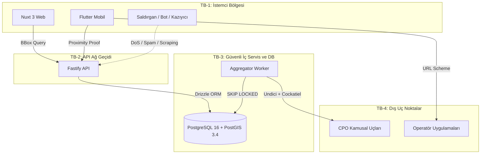

# Tehdit Modeli ve Karşı Önlemler: elektriklioto.com (Faz 1)

> **Belge Sürümü:** 1.0.0-faz1  
> **Durum:** Onaylandı (Teknik Karar Dokümanı)  
> **Hazırlayan:** Güvenlik ve Tehdit Modelleme Rolü  
> **Doğruluk Kaynakları:** `proje_kapsami.md`, `teknik_mimari_dokumani.md`, `paket_secim_raporu.md`, `backlog.md`, `guvenlik_tasarimi.md`

---

## 1. Yönetici Özeti ve Kapsam

`elektriklioto.com` (Faz 1); EV sürücülerine 16.788 istasyonu haritada sunan, kitle kaynaklı arıza tespiti yapan ve CPO uygulamalarına derin bağlantı kuran bir e-Mobilite Asistanıdır. Platform elektrik satışı, faturalama ve ödeme aracılığı yapmaz.

Bu doküman; güven sınırlarını, aktörleri, STRIDE saldırı vektörlerini, kötüye kullanım senaryolarını ve paket seçim raporuna tam uyumlu uygulanabilir mimari karşı önlemleri belirler.

---

## 2. Zorunlu Kısıtlar, Çatışmalar ve Varsayımlar

Aşağıdaki kararlar projenin değişmez kısıtlarıdır; mimari doğrudan bu temele kurulur:

- **Alan Adı ve Marka:** `elektriklioto.com` tüm web, API (`api.elektriklioto.com`) ve mobil varlıkların tek çatısıdır (zorunlu).
- **Web Çatısı:** Nuxt.js / Vue.js (SSR/SSG uyumlu) Fastify API'sini tüketir (zorunlu).
- **Mobil İstemci:** Flutter ile geliştirilecektir; tek kod tabanı kullanılır (zorunlu).
- **Backend Çatısı:** Node.js / TypeScript üzerinde Fastify framework (zorunlu).
- **Veritabanı:** `postgis/postgis:16-3.4` Docker konteyneri üzerinde çalışır; `docker-compose.yml` ile yönetilir (zorunlu).
- **Lisans Sınırı:** Platform hiçbir aşamada "Lisanslı Şarj Operatörü" statüsü alamaz; EPDK elektrik satışı ve faturalama yapamaz; e-Mobilite Asistanı / EMP adayıdır (zorunlu).
- **Konum Gizliliği ve KVKK:** Kullanıcı GPS konumu sunucuda saklanamaz; anlık harita merkezleme için geçici (in-memory) kullanılır, geçmiş koordinat tutulamaz (zorunlu).
- **Şema Göçü:** Üretimde elle DDL yasaktır; yalnızca sürümlenmiş migration dosyaları kullanılır (zorunlu).
- **Tasarım Bütünlüğü:** `tasarim_sistemi.md` token'ları tek kaynaktır; Nuxt CSS ve Flutter Dart çıktıları tek derleme betiğiyle senkronize edilir; arayüz geliştirici görsel karar veremez (zorunlu).
- **Erişilebilirlik Tabanı:** WCAG 2.1 AA tabandır; metin kontrastı ≥ 4.5:1, dokunma hedefleri webde ≥ 44x44 CSS px, mobilde ≥ 48x48 pt olmalıdır (zorunlu).
- **Tohum Veri:** EPDK 16.788 istasyon ve 179 marka içeren `istasyonlar.json` kanonik çapadır (`ŞRJ/xxxx`); `lat`/`lon` mevcut kabul edilir, geocoding yapılmaz (zorunlu).
- **Eksik Veri Modeli:** Soket tipi, güç, tarife ve canlı doluluk Faz 1 başlangıcında YOKTUR; şema bu alanları `NULL` kabul eder; arayüz boşken de anlamlı görünmek zorundadır; uydurma veri girilemez (zorunlu).

> **ÇATIŞMA:** "Mobil istemci Flutter ile geliştirilecektir. (zorunlu)" kısıtı teknik olarak imkânsızdır. Ortam raporunda `flutter` ve `dart` komutları "Exec format error" nedeniyle BOZUK durumdadır. İstemcinin geliştirilebilmesi için onarım gereklidir.

> **ÇATIŞMA:** "Paket yöneticisi tekliği: Ortamda pnpm 10.20.0 ölçülmüştür" kısıtı ortam gerçeğiyle uyuşmamaktadır. Güncel ortam raporunda `pnpm` YOK olarak listelenmiştir. Paylaşımlı workspace mimarisi için KURULUM GEREKİYOR: pnpm.

> **Varsayım:** Flutter ve pnpm ortam sorunları çözülene kadar tehdit modeli; Fastify v5, Nuxt 3, PostgreSQL 16 + PostGIS 3.4 ve platform güvenlik mekanizmaları (iOS App Attest / Android Play Integrity) temelinde yürütülmüştür.

---

## 3. Güven Sınırları ve Saldırı Yüzeyi



### 3.1. Saldırı Yüzeyleri
- **Harita BBox API (`GET /api/v1/stations?bbox=...`):** CBS hesaplama yükü ve koordinat kazıma yüzeyi.
- **Arıza Bildirimi (`POST /api/v1/stations/:id/reports`):** Asılsız ihbarla harita manipülasyon yüzeyi.
- **Rota Aktarımı (`GET /r/:payload`):** Base64 QR parametre tahrifatı ve açık yönlendirme yüzeyi.
- **Harici Deep-Link:** Operatör şema çağrılarında araya girme ve sahte uygulama tetikleme yüzeyi.
- **Dış CPO Uçları:** Worker sürecinin IP engeline takılması ve veri zehirlenmesi yüzeyi.

---

## 4. Tehdit Aktörleri

| Aktör | Motivasyon ve Yöntem | Hedef Güven Sınırı |
|---|---|---|
| **TA-1: Sabotajcı / Trol** | İstasyonları asılsız "Arızalı" işaretleyip haritayı karalamak (GPS Spoofing, bot). | TB-1 → TB-2 (`reports:create`) |
| **TA-2: Ticari Kazıyıcı** | 16.788 istasyon ve durumu izinsiz topluca çekmek (Headless botnet, proxy). | TB-1 → TB-2 (`stations` BBox) |
| **TA-3: Ağ Dinleyicisi** | Kullanıcı güzergahı veya oturum belirtecini çalmak (Açık Wi-Fi). | TB-1 ↔ TB-2 Kanalı |
| **TA-4: Tersine Mühendis** | Mobil ikiliyi decompile edip HMAC anahtarı ve iç uçları çözmek (Frida, APK). | TB-1 (Mobil İkili & Depolama) |
| **TA-5: Kötü Niyetli Kaynak**| Hatalı tarife/durum dönerek sistemi zehirlemek veya 429/5xx ile worker tıkamak. | TB-4 → TB-3 (Senkronizasyon) |

---

## 5. STRIDE Tehdit Analizi ve Kararlar

- **T-01 [Spoofing - GPS Spoofing]:** Bildirimde App Attest / Play Integrity donanımı ve mobilde `PAKET KULLAN: crypto ^3.0.6` ile tek kullanımlık `proximity_proof` (HMAC-SHA256) zorunludur. Sahte GPS ile istasyonların kapatılmasını önler; tasdiksiz cihazlar HTTP 401 ile reddedilir. *Alternatif: SMS OTP (yüksek maliyet/KVKK nedeniyle elendi).*
- **T-02 [Spoofing - Deep-Link Hijacking]:** `PAKET KULLAN: url_launcher ^6.3.1` ile yalnızca `operator.deep_link_config` beyaz listesindeki şemalar tetiklenir; hedef paket Android'de `setPackage`, iOS'ta Universal Links ile doğrulanır. Sahte ödeme uygulamasına yönlendirmeyi engeller; desteklenmeyen durumlarda istasyon kodu panoya kopyalanır (`clipboard_fallback: true`). *Alternatif: Dinamik serbest URL (oltalama riskiyle elendi).*
- **T-03 [Tampering - Rota QR Tahrifatı]:** Webde üretilen Base64 rota yükü sunucuda `node:crypto` ile `HMAC-SHA256` üzerinden imzalanır (`sig`). İstemci mobil `crypto ^3.0.6` ile doğrular. Zararlı durak veya URL parametresi enjeksiyonunu önler; süresi geçen (48 saat) veya imzasız rotalar reddedilir. *Alternatif: İmzasız JSON Base64 (tahrifat riskiyle elendi).*
- **T-04 [Tampering - Tohum ve Şema Tahrifatı]:** `istasyonlar.json` SHA-256 sağlama toplamı CI'da doğrulanır; şema göçleri yalnızca `PAKET KULLAN: drizzle-kit ^0.30.5` migration dosyaları ile yapılır; elle DDL yasaktır. EPDK veri bütünlüğünü korur; hatalı kayıtlar `seed_rejects` tablosuna ayrılır. *Alternatif: Elle SQL çalıştırma (denetimsizlikle elendi).*
- **T-05 [Repudiation - Eylemi İnkar Etme]:** Kişisel veri toplanmaz; her bildirim donanım `device_uid` ve tek kullanımlık `nonce` ile itibar motorunda izlenir. Sürekli asılsız ihbar yapan cihazları tespit eder; şüpheli cihazlar sessizce shadow-ban listesine alınır. *Alternatif: T.C. Kimlik / telefon kaydı (KVKK kısıtına aykırılıkla elendi).*
- **T-06 [Information Disclosure - Konum Sızıntısı]:** Sıfır Konum Saklama uygulanır; istemci tekil GPS göndermez, sınır kutusunu (`bbox`) iletir. `station_report` tablosunda ve loglarda koordinat tutulamaz. KVKK / GDPR konum gizliliği kısıtını sağlar; sunucu sızsa dahi kullanıcıya ait güzergah verisi bulunamaz. *Alternatif: Koordinatları şifreli saklamak (kısıt "hiç tutulamaz" dediği için elendi).*
- **T-07 [Information Disclosure - Mimari Sızıntısı]:** Fastify `setErrorHandler` ile tüm 500 hataları RFC 7807 Problem Details formatında maskelenir; stack trace dışarı verilmez. Veritabanı ve tablo yapısının saldırgana sızmasını önler. *Alternatif: Ayrıntılı hata logu dönmek (bilgi ifşasıyla elendi).*
- **T-08 [Denial of Service - Spatial DoS]:** `PAKET KULLAN: @sinclair/typebox ^0.34.52` ile BBox genişliği maksimum 0.5 derece (~50 km) ile sınırlanır; `@fastify/rate-limit ^10.2.0` ile IP başına 120 req/dk uygulanır; Zoom < 10 için `ST_SnapToGrid` kullanılır. Ağır PostGIS kesişim sorgularıyla veritabanının çökmesini önler; p95 < 40ms korunur. *Alternatif: Sınırsız BBox sorgusu (çökme riskiyle elendi).*
- **T-09 [Denial of Service - Worker Kilitlenmesi]:** `PAKET KULLAN: cockatiel ^3.2.1` Circuit Breaker devresi kurulur; 5 ardışık 429/5xx hatasında kaynak 15 dakika soğumaya alınır; `PAKET KULLAN: undici ^7.4.0` ile 500-2000ms rastgele gecikme (jitter) eklenir. Dış operatörlerin IP ban uygulamasını ve worker tıkanmasını engeller. *Alternatif: Gecikmesiz agresif kazıma (IP engeli riskiyle elendi).*
- **T-10 [Elevation of Privilege - Yetki Atlama]:** Genel API'de istasyon/soket güncelleyen hiçbir `PUT`, `POST`, `DELETE` rotası açılmaz; veri yazımı yalnızca iç ağdaki Worker süreciyle yapılır. Dışarıdan yetki yükselterek veri tahrifatı yapılmasını imkânsız kılar. *Alternatif: Admin paneli açmak (Faz 1 kapsam dışı kuralıyla elendi).*

---

## 6. Kötüye Kullanım Senaryoları (Abuse Cases)

### 6.1. Arıza Bildirimi Sabotajı (Sybil / ICEing)
- **Akış:** Rakip veya troller, istasyonları haritada "Arızalı" göstermek için botlarla sahte ihbar yağdırır.
- **Önleme:** Yalnızca tasdikli (`device_token`) cihazlar rapor atabilir; `geolocator ^13.0.0` ile ≤ 50m mesafe yerel doğrulanıp `crypto ^3.0.6` ile `proximity_proof` iletilir. Haritada "Arızalı" rozeti için 2 saatte 3 bağımsız tasdikli cihaz ihbarı zorunludur. Asılsız ihbarcılar sessiz shadow-ban listesine (`is_suppressed: true`) alınır; istek başarılı döner fakat skora katılmaz.

### 6.2. Konum Takibi ve Güzergah Çıkarma
- **Akış:** Ağ paketleri veya loglar üzerinden sürücünün ev/iş adresi ve seyahat geçmişi profillenmek istenir.
- **Önleme:** Veritabanında koordinat sütunu (`user_lat`, `user_lon`, `geom`) açılamaz. Harita sorgularında nokta değil `bbox` gönderilir. Fastify loglarında IP ve parametreler maskelenir.

### 6.3. Yüksek Yoğunluklu Coğrafi Kazıma
- **Akış:** Rakip firma, elektriklioto.com'un normalize 179 markalık veritabanını çalmak için koordinat taraması yapar.
- **Önleme:** `@fastify/rate-limit` ile IP başına dakikada 120 istek sınırı uygulanır. Tek sorguda maksimum BBox alanı 0.5 derece ile sınırlanır; aşımda HTTP 400 döner. Canlı veri Faz 1'de `NULL` olduğundan çalınabilir ticari sır bulunmaz.

### 6.4. Sahte Deep-Link ile Oltalama
- **Akış:** Deep-link alanına zararlı web bağlantısı enjekte edilerek sürücünün sahte ödeme sayfasına yönlendirilmesi.
- **Önleme:** Yalnızca kayıtlı şemalar (`zes://`, `trugo://` vb.) `operator.deep_link_config` beyaz listesinden kabul edilir. Keyfi web yönlendirmesi engellenir; desteklenmeyen durumlarda istasyon kodu panoya kopyalanır (`clipboard_fallback: true`).

### 6.5. Yasal Lisans Sınırı Aşımı
- **Akış:** Sistemde elektrik satışı veya faturalama özellikleri açılarak lisanssız şarj operatörlüğü cezasına maruz kalınması.
- **Önleme:** Projede ödeme, kart veya fatura uç noktası/tablosu yer alamaz. CI hattında `payment`, `billing`, `invoice` kelimelerini denetleyen statik kural çalışır. EMP feragatnamesi tüm sayfalarda beyan edilir.

---

## 7. Paket Seçim Raporu Uyum Matrisi

| Güvenlik Alanı | Karşı Önlem Mekanizması | Paket Kararı | Seçilen Kütüphane |
|---|---|---|---|
| **DoS & Kazıma** | Token-Bucket API Hız Sınırlama | `PAKET KULLAN` | `@fastify/rate-limit ^10.2.0` |
| **Ağ Güvenliği & CSP**| HTTP Güvenlik Başlıkları | `PAKET KULLAN` | `@fastify/helmet ^13.0.0` |
| **Köken İzolasyonu** | CORS İzin Listesi | `PAKET KULLAN` | `@fastify/cors ^10.0.0` |
| **CPO Koruması** | Circuit Breaker & Retry | `PAKET KULLAN` | `cockatiel ^3.2.1` |
| **Dış HTTP İstekleri**| Bağlantı Havuzu Yönetimi | `PAKET KULLAN` | `undici ^7.4.0` |
| **SQL Enjeksiyonu** | Parametreli PostGIS Sorgusu | `PAKET KULLAN` | `drizzle-orm ^0.45.2` |
| **Şema Bütünlüğü** | Sürümlenmiş SQL Göçleri | `PAKET KULLAN` | `drizzle-kit ^0.30.5` |
| **Giriş Doğrulama** | Şema ve Tip Doğrulayıcı | `PAKET KULLAN` | `@sinclair/typebox ^0.34.52` |
| **Sözleşme Denetimi**| OpenAPI 3.1 CI Kuralları | `PAKET KULLAN` | `@stoplight/spectral-cli ^6.14.0` |
| **HMAC İmza** | Kriptografik Belirteç | `PAKET KULLAN` | `crypto ^3.0.6` / `node:crypto` |
| **Cihaz İçi Mesafe** | 50m In-Memory Doğrulama | `PAKET KULLAN` | `geolocator ^13.0.0` |
| **Çevrimdışı Bellek**| Güvenli İstemci Önbelleği | `PAKET KULLAN` | `hive_ce_flutter ^2.2.0` |
| **Deep-Link Başlatma**| Beyaz Listeli Şema Çağrısı | `PAKET KULLAN` | `url_launcher ^6.3.1` |
| **İş Kuyruğu** | ACID Görev Tüketimi | `KENDİMİZ YAZ` | PostgreSQL `FOR UPDATE SKIP LOCKED` |
| **Unicode & Sınır** | `ŞRJ/` ve TR Harf Katlama | `KENDİMİZ YAZ` | `packages/utils` Fonksiyonları |

---

## 8. Uygulanabilir Güvenlik Kuralları (Geliştirici Rehberi)

### 8.1. Kimlik ve Yetkilendirme
- **[KURAL-AUTH-01]** `GET /api/v1/stations` ve detay rotalarında kimlik doğrulama zorunluluğu **KONULAMAZ**; genele açık kalmalıdır.
- **[KURAL-AUTH-02]** `POST /api/v1/stations/:id/reports` rotasında `X-Device-Attestation` doğrulanmadan işlem yapılamaz (eksikse HTTP 401).
- **[KURAL-AUTH-03]** Kullanıcı şifresi saklanamaz; oturumlar yalnızca tek kullanımlık Magic Link ile yönetilir.

### 8.2. Konum Gizliliği ve KVKK
- **[KURAL-KVKK-01]** Veritabanı tablolarına kullanıcının koordinatını (`lat`, `lon`, `geom`) kaydeden sütun **EKLENEMEZ**.
- **[KURAL-KVKK-02]** Harita sorgularında API'ye GPS koordinatı gönderilemez; yalnızca `bbox` sınır kutusu iletilir.
- **[KURAL-KVKK-03]** `station_report` kayıtları 90 gün sonra aylık `DROP PARTITION` ile kalıcı olarak silinmelidir.

### 8.3. Veritabanı ve Mekânsal Sorgulama
- **[KURAL-DB-01]** PostGIS sorgularında string birleştirme (`sql.raw`) **YASAKTIR**; tüm sorgular Drizzle ORM parametreli ifadeleriyle yazılır.
- **[KURAL-DB-02]** `bbox` parametresi alan uç noktalarda en/boy farkı > 0.5 derece olan istekler HTTP 400 ile reddedilir.
- **[KURAL-DB-03]** Üretimde elle DDL çalıştırmak yasaktır; şema değişiklikleri yalnızca `drizzle-kit` migration dosyalarıyla yapılır.

### 8.4. Dış Entegrasyon ve Yasal Sınır
- **[KURAL-INT-01]** Harici CPO isteklerinde `cockatiel` Circuit Breaker ve 500-2000ms rastgele gecikme (jitter) zorunludur.
- **[KURAL-INT-02]** Deep-link URL'leri doğrudan harici veriden okunup açılamaz; `operator.deep_link_config` beyaz listesinden geçirilmelidir.
- **[KURAL-LEGAL-01]** Sistemde ödeme, faturalama, kart saklama veya elektrik satışı uç noktası geliştirilemez.

### 8.5. Sapma Politikası
Geliştiricinin zorunlu teknik bir kısıt nedeniyle paket seçim kararlarından sapması gerekirse, ilgili satırın hemen üzerinde şu formatta yorum bırakması zorunludur:
```typescript
// SAPMA: [Gerekçe açıklaması] - Paket seçim raporunda X seçilmişti ancak Y kısıtı nedeniyle Z kullanıldı.
```

---

## 9. DREAD Risk Değerlendirme Matrisi

| Tehdit | Tehdit Tanımı | Hasar | Yeniden Üretim | Suistimal | Etkilenen | Keşif | DREAD | Risk Seviyesi | Öncelik |
|---|---|---|---|---|---|---|---|---|---|
| **T-06** | Kullanıcı GPS Koordinatı Sızıntısı (KVKK İhlali) | 10 | 4 | 5 | 9 | 4 | **6.4** | **YÜKSEK** | P0 |
| **T-01** | Kitle Kaynaklı Arıza İhbarı Sabotajı (Sybil) | 8 | 7 | 6 | 8 | 8 | **7.4** | **YÜKSEK** | P0 |
| **T-08** | Devasa BBox ile Spatial PostGIS DoS | 9 | 9 | 8 | 10 | 8 | **8.8** | **KRİTİK** | P0 |
| **T-02** | Zararlı Operatör Şeması / Deep-Link Kaçırma | 8 | 5 | 5 | 6 | 5 | **5.8** | **ORTA** | P1 |
| **T-09** | CPO Uç Noktalarının Engellenmesi / Worker Starvation | 7 | 8 | 6 | 8 | 7 | **7.2** | **YÜKSEK** | P0 |
| **T-03** | Rota QR Kod Payload Manipülasyonu | 6 | 6 | 5 | 4 | 6 | **5.4** | **ORTA** | P1 |
| **T-10** | Yasal Lisans Sınırı Aşımı (EPDK Cezası) | 10 | 2 | 2 | 10 | 4 | **5.6** | **YÜKSEK** | P0 |
| **T-07** | Ayrıntılı Hata Mesajları ile İç Mimari Sızıntısı | 5 | 8 | 8 | 4 | 7 | **6.4** | **ORTA** | P1 |

---

## 10. Tehdit Modeli Doğrulama ve CI/CD Kalite Kapıları

1. **Sözleşme Denetimi:** `@stoplight/spectral-cli` ile OpenAPI 3.1 güvenlik şemaları ve BBox sınır kısıtları test edilir.
2. **Statik Lisans Bariyeri:** `@biomejs/biome` ve regex tarayıcılar `payment`, `billing` terimlerini veya raw SQL kullanımını tespit ettiğinde build'i kırar.
3. **KVKK Şema Denetimi:** `vitest` entegrasyon testleri veritabanı şemasında kullanıcı koordinat veya IP sütunları olmadığını doğrular.
4. **Hız Sınırlama Doğrulaması:** Otomatik testler dakikada 120 isteği aşan istemcilerin HTTP 429 aldığını teyit eder.
