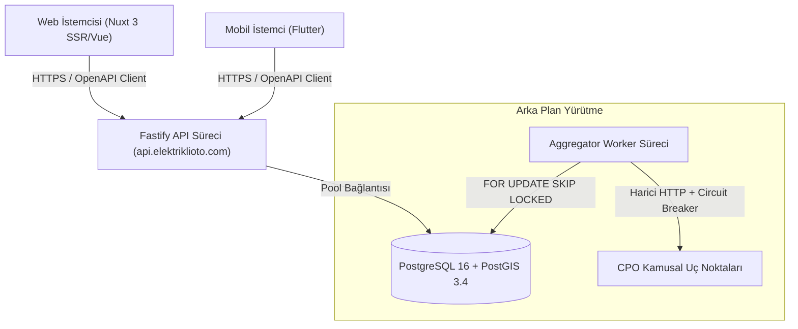
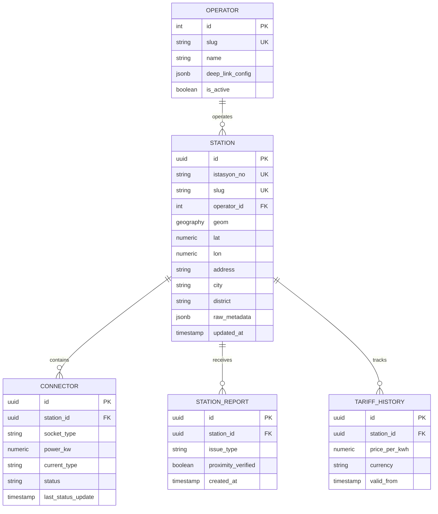

# Teknik Mimari Dokümanı: elektriklioto.com

> **Belge Sürümü:** 1.0.0-faz1  
> **Durum:** Onaylandı (Teknik Karar Dokümanı)  
> **Kapsam:** Faz 1 Mimari, Modül Sınırları, Veri Modeli ve Altyapı Topolojisi  
> **Doğruluk Kaynağı:** `proje_kapsami.md` ve `workspace/docs/ortam_raporu.md`

---

## 1. Yönetici Özeti ve Mimari Vizyon

elektriklioto.com (Faz 1), elektrikli araç sürücülerine onlarca CPO uygulaması arasında kaybolmadan tek bir harita üzerinden Türkiye şarj altyapısını sunan bir **e-Mobilite Asistanı ve Bilgi Hub'ıdır**. Sistem, EPDK Şarj Ağı İşletmeci Lisansı gerektiren elektrik satışı veya TCMB/BDDK lisansı gerektiren ödeme aracılığı yapmaz; operasyonel derin bağlantılar (deep-linking) kurar.

Mimari yaklaşım; operasyonel karmaşıklığı en aza indiren, yüksek coğrafi sorgu hızına (p95 < 40ms) odaklanan, tip güvenliğini OpenAPI 3.1 ile uçtan uca sağlayan ve KVKK gereği konum gizliliğini donanım seviyesinde koruyan bir **Modüler Monolit** modelidir.

---

## 2. Zorunlu Kısıtlar, Çatışmalar ve Varsayımlar

Aşağıdaki kararlar projenin değişmez kısıtlarıdır ve mimari doğrudan bu zemin üzerine inşa edilmiştir:

- **Alan Adı ve Marka:** `elektriklioto.com` tüm web, API (`api.elektriklioto.com`) ve mobil varlıkların tek çatısıdır (zorunlu).
- **Web Çatısı:** Nuxt.js / Vue.js (SSR/SSG uyumlu) Fastify API'sini tüketir (zorunlu).
- **Backend Çatısı:** Node.js / TypeScript üzerinde Fastify framework (zorunlu).
- **Veritabanı:** `postgis/postgis:16-3.4` sürümü Docker üzerinde çalışır; yapılandırma `docker-compose.yml` ile depoya işlenir (zorunlu).
- **Lisans Sınırı:** Platform hiçbir aşamada "Lisanslı Şarj Operatörü" statüsü alamaz; EPDK elektrik satışı ve faturalama yapamaz (zorunlu).
- **Konum Gizliliği:** Kullanıcı GPS koordinatları sunucuda saklanamaz; anlık in-memory işlenir, geçmiş güzergah tutulamaz (zorunlu).
- **Şema Göçü:** Üretimde elle DDL yasaktır; yalnızca sürümlenmiş migration dosyaları kullanılır (zorunlu).
- **Tasarım Bütünlüğü:** `tasarim_sistemi.md` token'ları tek kaynaktır; Nuxt CSS ve Flutter Dart çıktıları tek derleme betiğiyle senkronize edilir (zorunlu).
- **Tohum Veri:** EPDK 16.788 istasyon ve 179 marka içeren `istasyonlar.json` kanonik çapadur; `lat`/`lon` mevcut kabul edilir, geocoding yapılmaz (zorunlu).
- **Eksik Veri:** Soket tipi, güç, tarife ve canlı doluluk Faz 1 başlangıcında `NULL` kabul edilir; sistem bu alanlar boşken çalışacak şekilde modellenir (zorunlu).

> **ÇATIŞMA:** "Mobil istemci Flutter ile geliştirilecektir. (zorunlu)" kısıtı teknik olarak imkânsızdır. Ortam raporunda `flutter` ve `dart` komutları "Exec format error" nedeniyle BOZUK durumdadır. İstemcinin geliştirilebilmesi için onarım gereklidir.

> **ÇATIŞMA:** "Paket yöneticisi tekliği: Ortamda pnpm 10.20.0 ölçülmüştür" kısıtı ortam gerçeğiyle uyuşmamaktadır. Güncel ortam raporunda `pnpm` YOK olarak listelenmiştir. Paylaşımlı workspace mimarisi için KURULUM GEREKİYOR: pnpm.

> **Varsayım:** Mobil geliştirme ortamı onarılana ve `pnpm` kurulana kadar, backend ve web modülleri ortamda ölçülen `node v22.21.0` ve `npm 10.9.4` ile başlatılabilir; ancak üretim monorepo standardı için pnpm zorunludur.

---

## 3. Sistem Mimarisi ve Süreç Topolojisi

Sistem, operasyonel yükü düşürmek amacıyla mikroservis yerine **Modüler Monolit** mimarisinde iki bağımsız süreç (process) olarak kurgulanmıştır:



### 3.1. Süreç Sınırları ve Dağıtım Kararları
- **Karar:** `api` (HTTP/REST) ve `worker` (senkronizasyon ve kitle-kaynak işleme) süreçleri aynı kod deposunda fakat bağımsız Node.js runtime konteynerlerinde çalıştırılır.
- **Gerekçe:** Ağır harici veri çekme ve CBS hesaplama işlerinin istemciye hizmet veren HTTP thread havuzunu bloke etmesini (event loop starvation) engellemek.
- **Sonuç:** `api` süreci stateless kalır; yatayda bağımsız ölçeklenir.
- **Alternatif:** *Kubernetes/Mikroservis parçalanması:* Faz 1 operasyonel maliyeti ve karmaşıklığı nedeniyle elendi.

---

## 4. Modül Sınırları ve İstemci Mimarisi

### 4.1. Core API Servisi (`apps/api`)
Fastify mimarisi eklenti (plugin) tabanlıdır. Her modül kendi rotalarını, iş mantığını ve veri erişim katmanını izole eder:
- **Station Module:** Viewport tabanlı harita listeleme (`bbox`), detay sorguları ve slug yönlendirmesi.
- **Operator Module:** 179 markanın sözlük verisi, marka sayfaları ve deep-link URL şablonları.
- **Feedback & Crowdsource Module:** Arıza bildirimlerinin kabulü, spam filtreleme ve `proximity_proof` doğrulama.
- **Route Bridge Module:** Web'de oluşturulan rota dizilerini mobil uygulamaya aktaran kısa kod/Base64 URI çözücü.

### 4.2. Aggregator Worker Süreci (`apps/worker`)
- **Tohumlama (Seed Runner):** `istasyonlar.json` dosyasını doğrulayan, normalize eden ve veritabanına idempotence kuralıyla basan CLI yürütücüsü.
- **Sync Jobs:** Dış CPO kaynaklarından periyodik veri toplayan zamanlanmış görevler.
- **Health Evaluator:** 24 saat veri gelmeyen kaynakları izole edip arayüze "veri güncel değil" bayrağı basan denetçi.

### 4.3. Web Platformu (`apps/web` - Nuxt.js / Vue 3)
- **Katalog ve SEO (SSR/ISR):** `/istanbul/kadikoy/sarj-istasyonlari` ve `/{operator}/{slug}` sayfaları Nuxt Nitro motoru üzerinden sunucu tarafında render edilir (Lighthouse SEO > 90, FCP < 1.2s).
- **İnteraktif Harita (Client-Only):** Harita bileşeni hydration uyumsuzluğunu (FOUC) ve sunucu yükünü önlemek için `<ClientOnly>` etiketiyle yalnızca istemci tarafında ayağa kalkar.
- **Tema Enjeksiyonu:** Sistem tercihi ve çerez tabanlı tema seçimi `app.vue` içinde HTML render edilmeden önce `class="dark"` olarak gömülür; sayfa yüklenme parlaması engellenir.

### 4.4. Mobil İstemci (`apps/mobile` - Flutter)
- **Mimari:** BLoC veya Riverpod tabanlı reaktif durum yönetimi; harita motoru olarak Mapbox / Google Maps SDK.
- **İzole Çalışma (Worker Thread):** Büyük GeoJSON yanıtlarının ayrıştırılması (parsing) ana arayüz thread'i dışında `compute()` / Isolate ile gerçekleştirilir (60 FPS garantisi).
- **Çevrimdışı Önbellek:** Cihazda son ziyaret edilen koordinatların istasyon özetleri Hive anahtar-değer deposunda saklanır; ağ koptuğunda harita boşalmaz.

### 4.5. Tasarım Token Derleme Hattı (`packages/design-tokens`)
- **Karar:** `tasarim_sistemi.md` içerisindeki görsel token'lar (renk, tipografi, aralık, köşe yarıçapı) `tokens.json` dosyasında tutulur.
- **Gerekçe:** Web ve mobilin tek tasarım dilini paylaşması kısıtı.
- **Sonuç:** Tek bir Node.js derleme betiği `tokens.json` dosyasından web için `tokens.css` (CSS Custom Properties), Flutter için `tokens.dart` (statik sınıflar) üretir. Elle değişken yazımı CI üzerinde engellenir.
- **Alternatif:** *Figma Tokens API / Harici SaaS:* Dış bağımlılık ve lisans maliyeti nedeniyle elendi.

---

## 5. Veri Mimarisi ve Depolama Stratejisi

### 5.1. PostgreSQL + PostGIS İlişkisel Modeli
Veritabanı `postgis/postgis:16-3.4` üzerinde çalışır. Tüm mekânsal veriler WGS 84 (SRID 4326) standardında saklanır.



### 5.2. Kanonik Kimlik, Unicode Normalizasyonu ve Entity Resolution
- **Kanonik Çapa (`istasyon_no`):** EPDK tarafından atanan resmî numara (`ŞRJ/xxxx`) tekil ve değiştirilemez doğal anahtardır. Dahili sistemler için UUIDv7 (`station_uid`) birincil anahtardır.
- **Unicode ve Türkçe Karakter Standartı:** `ŞRJ/` öneki ve tüm istasyon adları veritabanına girmeden önce Unicode NFC normalizasyonuna tabi tutulur. URL slug üretiminde Türkçe karakter katlaması (`İ→i`, `I→ı`, `ş→s`, `ğ→g`) tek bir merkezi yardımcı modülde (`packages/utils`) yapılır.
- **Mekânsal Doğrulama Kapısı (Seed Gate):** Tohumlama sırasında `lat`/`lon` değerleri Türkiye Bounding Box (`ST_MakeEnvelope(25.5, 35.5, 45.0, 42.5, 4326)`) dışında kalan, `(0,0)` olan veya ters yazılmış kayıtlar `seed_rejects` tablosuna gerekçesiyle fırlatılır.

### 5.3. Nullable DTO ve Eksik Veri Modeli
- **Karar:** Soket tipi, güç (kW), canlı doluluk ve anlık tarife alanları veritabanında ve API yanıtlarında kesinlikle varsayılan uydurma değerlerle (mock) doldurulmaz; `NULL` döner.
- **Sonuç:** OpenAPI şemasında `nullable: true` olarak tanımlanır. Arayüz tarafında bu alanlar "Operatör Verisi Bekleniyor" rozeti ve kullanıcı katkı çağrısı (CTA) ile render edilir.

### 5.4. PostgreSQL `SKIP LOCKED` Tabanlı İş Kuyruğu
- **Karar:** Asenkron işler ve CPO veri çekme sıralaması için Redis veya RabbitMQ kullanılmaz. PostgreSQL tablosu üzerinde `FOR UPDATE SKIP LOCKED` deseni uygulanır.
- **Gerekçe:** İlk fazda dış altyapı bağımlılığını asgaride tutmak ve işlem tutarlılığını (ACID) tek veritabanında sağlamak.
- **Sonuç:** `sys_job_queue` tablosu üzerinden worker süreçleri eşzamanlı kilitlenme yaşamadan görevleri tüketir.
- **Alternatif:** *Redis + BullMQ:* Ek bellek ve operasyonel konteyner gerektirdiği için Faz 1 kapsamından çıkarıldı.

### 5.5. Zaman Serisi Bölümleme (Partitioning)
- **Karar:** `station_report` (arıza bildirimleri) ve `tariff_history` (fiyat kayıtları) tabloları `created_at` üzerinden aylık aralıklarla PostgreSQL Declarative Table Partitioning ile bölünür.
- **Gerekçe:** Zaman serisi verisinin hızlı büyümesi durumunda spatial istasyon sorgularının indeks performansını korumak.

---

## 6. Güvenlik, Gizlilik ve KVKK Uyum Mimarisi

### 6.1. Sıfır Konum Saklama İlkesi ve Proximity Proof
KVKK ve konum gizliliği kısıtı gereğince, istemci GPS koordinatları sunucuda kesinlikle veritabanına veya diske yazılamaz:
1. **Harita Sorguları:** Kullanıcı konumu yalnızca istemci belleğinde (in-memory) tutulur ve ekrandaki harita kutusu koordinatlarına (`bbox: min_lon, min_lat, max_lon, max_lat`) dönüştürülerek API'ye iletilir. Sunucu kullanıcının tam noktasını bilmez.
2. **Kitle Kaynaklı Arıza Doğrulama (`proximity_proof`):**
   - İstemci cihaz, istasyon ile arasındaki mesafeyi lokalde hesaplar.
   - İstemci, API'ye ham konum göndermek yerine `ST_DWithin` kontrolü için tek kullanımlık, süreli (HMAC-SHA256 imzalı) bir doğrulama belirteci (`proximity_proof`) iletir.
   - Bildirim tablosunda yalnızca `proximity_verified: true` bayrağı ve `station_uid` saklanır; kullanıcı koordinatı atılır.

### 6.2. Anonim Cihaz Kimlik Doğrulaması (Device Attestation)
- Kullanıcıların haritayı görüntülemesi, istasyon araması ve filtrelemesi için hesap açması gerekmez.
- Bildirim ve favori ekleme işlemleri için mobil istemcide Apple App Attest ve Google Play Integrity API kullanılarak üretilen anonim cihaz anahtarı (`device_uid`) kabul edilir.
- E-posta ve telefon toplama yalnızca çoklu cihaz favori senkronizasyonu isteyen kullanıcılara opsiyonel bırakılarak KVKK yükümlülüğü en aza indirilir.

### 6.3. API Güvenliği, Rate-Limiting ve Bot Koruması
- **Hız Sınırlaması:** Fastify `@fastify/rate-limit` ile IP ve anonim cihaz token'ı bazında Token Bucket algoritması uygulanır (standart istemci: 120 istek/dakika).
- **Shadow-Ban:** Belirli bir eşiğin üzerinde asılsız arıza ihbarı yapan cihaz kimlikleri sessiz modda engellenir (istek başarılı döner ancak istasyon güven skorunu etkilemez).

---

## 7. İletişim Protokolleri ve Entegrasyon Katmanı

### 7.1. OpenAPI 3.1 Sözleşme Tabanlı Kod Üretimi
- **Tek Doğruluk Kaynağı:** Backend Fastify rotaları `zod` veya `typebox` şemaları üzerinden OpenAPI 3.1 spesifikasyonunu (`openapi.json`) otomatik üretir.
- **İstemci Kod Üretimi:** Web ve mobil istemciler için TypeScript API istemcisi ve Dart DTO sınıfları CI hattında otomatik derlenir. Elle API DTO yazmak yasaktır; şema uyumsuzluğunda build kırılır.

### 7.2. Coğrafi Bounding Box (BBox) ve Delta Senkronizasyon
16.788 istasyonun tek seferde çekilmesi yasaktır:
- **Spatial BBox API:** İstemci haritayı kaydırdıkça `/api/v1/stations?bbox=lon1,lat1,lon2,lat2&zoom=12` çağrısı yapar.
- **Sunucu İçi Kümeleme:** Zoom seviyesi 10'un altındayken PostGIS `ST_SnapToGrid` ile kümelenmiş özet pinler döner; istemci belleği korunur.
- **Delta Senkronizasyon:** Detay ekranları ve açık haritalar için `GET /api/v1/stations/delta?since={epoch}` kullanılır; yalnızca değişen kayıtlar iletilir.

### 7.3. Akıllı Deep-Linking ve Clipboard Fallback Motoru
- **Konfigürasyon Yönetimi:** Operatörlerin şema formatları (`zes://station/{id}`, `trugo://charge?socket={id}`) veritabanındaki `operator.deep_link_config` alanında tutulur.
- **Clipboard Fallback Mekanizması:** Harici şema desteği bilinmeyen operatörlerde istemci `clipboard_fallback: true` yanıtı alır. İstasyon kodu işletim sistemi panosuna (clipboard) yazılır, operatörün market/web bağlantısı açılır ve kullanıcıya arayüzde yönlendirme uyarısı (toast) gösterilir.

### 7.4. Web'den Mobile Rota Aktarım Protokolü
- Web sitesinde planlanan rota, ara durak istasyonlarının `station_uid` listesini ve rota imzasını içeren sıkıştırılmış Base64 dizesine dönüştürülür (`elektriklioto.com/r/{base64_payload}`).
- Bu payload masaüstü ekranda dinamik bir QR koda basılır. Mobil kamera veya uygulama tarayıcısı bu kodu okuduğunda rota doğrudan yerel state içine yüklenir.

### 7.5. Dış Veri Kaynakları: Circuit Breaker ve Saygılı Kazıma
- Kamuya açık CPO uç noktalarından veri çeken worker'lar `opossum` kütüphanesi tabanlı **Circuit Breaker** ile korunur.
- 429 (Too Many Requests) veya 5xx yanıtlarında kaynak 15 dakika boyunca soğumaya (open circuit) alınır.
- Tüm istekler rastgele gecikmeler (jitter) ve üstel geri çekilme (exponential backoff) içerir; platform IP engellerine karşı korunur.

---

## 8. Ortam Envanteri, Altyapı ve Bağımlılık Topolojisi

Sistem bileşenleri `workspace/docs/ortam_raporu.md` içinde **ölçülmüş ve doğrulanmış** araçlarla sınırlıdır:

| Bileşen | Seçilen Teknoloji | Ortam Durumu / Envanter Karşılığı | Mimari Rolü |
|---|---|---|---|
| **Runtime** | Node.js v22.21.0 | **VAR** (`node v22.21.0`) | Fastify API ve Worker çalışma zamanı |
| **Paket Yöneticisi** | npm 10.9.4 | **VAR** (`npm 10.9.4`) | Paket yönetimi ve derleme betikleri |
| **Konteyner Motoru** | Docker 29.8.0 | **VAR** (`Docker 29.8.0`) | Veritabanı ve yerel servis orkestrasyonu |
| **Veritabanı** | PostgreSQL 16 + PostGIS 3.4 | **VAR** (Docker üzerinden çalışır) | Mekânsal veri ve ilişkisel depolama |
| **Derleme Araçları** | make 3.81 / git 2.45.2 | **VAR** (`make`, `git`) | Görev otomasyonu ve sürüm kontrolü |
| **Mobil SDK** | Flutter 3.27.1 / Dart | **BOZUK** (`Exec format error`) | Mobil istemci (onarım zorunlu) |

### 8.1. Kurulum ve Tedarik Gereksinimleri
Aşağıdaki bileşenler yerel ortamda eksiktir veya dış servis bağımlılığıdır; kurulumu zorunludur:
- **KURULUM GEREKİYOR: pnpm:** Monorepo paketlerinin (`apps/*`, `packages/*`) optimize yönetimi için pnpm kurulmalıdır (`npm install -g pnpm`).
- **KURULUM GEREKİYOR: postgis/postgis:16-3.4 Docker İmajı:** `docker compose pull` ile imaj çekilmelidir.
- **KURULUM GEREKİYOR: Flutter & Dart SDK Onarımı:** Ortamdaki arm64 Darwin mimarisine uygun Flutter/Dart ikilileri yeniden kurulmalıdır.
- **KURULUM GEREKİYOR: Harita Karo Sağlayıcı Anahtarı:** Mapbox veya eşdeğer vektör karo servisinden istemci API anahtarı temin edilmelidir (`VITE_MAP_KEY` / `MAPBOX_ACCESS_TOKEN`).
- **KURULUM GEREKİYOR: APNs / FCM Kimlik Bilgileri:** Mobil anlık bildirim altyapısı için Firebase / Apple Developer anahtarları temin edilmelidir.

### 8.2. Altyapı Orkestrasyonu (`docker-compose.yml`)
Yerel geliştirme ve CI ortamı için veritabanı konfigürasyonu depoya işlenir:
```yaml
services:
  postgres:
    image: postgis/postgis:16-3.4
    container_name: elektriklioto-db
    environment:
      POSTGRES_DB: ${DB_NAME:-elektriklioto}
      POSTGRES_USER: ${DB_USER:-postgres}
      POSTGRES_PASSWORD: ${DB_PASSWORD:-postgres}
    ports:
      - "5432:5432"
    volumes:
      - pgdata:/var/lib/postgresql/data
    healthcheck:
      test: ["CMD-SHELL", "pg_isready -U postgres"]
      interval: 5s
      timeout: 5s
      retries: 5

volumes:
  pgdata:
```

---

## 9. Fonksiyonel Olmayan Gereksinimler (NFR) ve Performans Bütçesi

- **Mekânsal Sorgu Gecikmesi (Spatial SLA):** 20 km yarıçapındaki BBox istasyon sorguları 16.788 istasyon ve 500.000 log kaydı altında **p95 < 40ms** (sunucu içi işleme süresi) içinde tamamlanmalıdır. İndeksleme için `CREATE INDEX idx_station_geom ON station USING GIST(geom);` zorunludur.
- **İstemci Render Akıcılığı:** Mobil harita kaydırmada arayüz takılması sıfır olmalı, sabit **60 FPS** korunmalıdır.
- **Web Performansı ve Erişilebilirlik:** Google Lighthouse SEO skoru **≥ 90**, Erişilebilirlik (a11y) skoru **≥ 95**, FCP **< 1.2s** olmalıdır.
- **Sözleşme Uyum Kapısı:** API ve istemci modelleri arasında CI aşamasında `spectral` ve tip denetimi çalıştırılır; sözleşme ihlalinde derleme derhal durdurulur.
