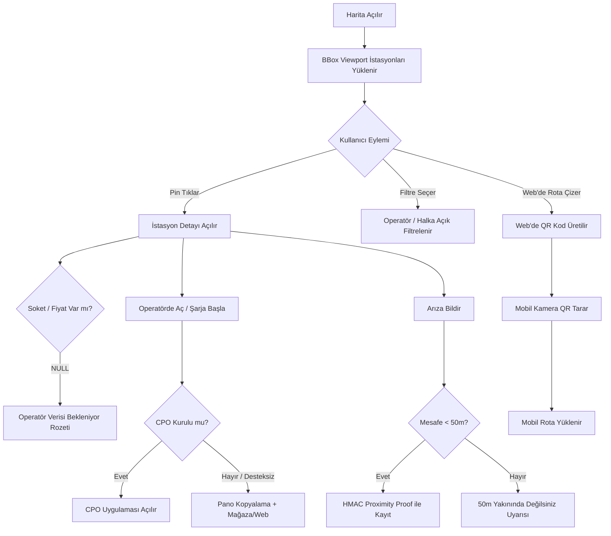

# Kullanıcı Deneyimi ve Etkileşim Akışları: elektriklioto.com (Faz 1)

> **Belge Sürümü:** 1.0.0-faz1  
> **Durum:** Onaylandı (UX & Etkileşim Karar Dokümanı)  
> **Kapsam:** Nuxt Web ve Flutter Mobil İstemcileri Ortak Kullanıcı Deneyimi  
> **Doğruluk Kaynakları:** `proje_kapsami.md`, `workspace/docs/teknik_mimari_dokumani.md`, `workspace/docs/backlog.md`, `workspace/docs/kabul_kriterleri.md`, `workspace/docs/veri_kaynagi_epdk.md`

---

## 1. Zorunlu Kısıtlar, Çatışmalar ve Varsayımlar

- **Alan Adı ve Marka:** `elektriklioto.com` tüm web, API (`api.elektriklioto.com`) ve mobil varlıkların tek çatısıdır (zorunlu).
- **Web Çatısı:** Nuxt.js / Vue.js (SSR/SSG uyumlu) Fastify API'sini tüketir (zorunlu).
- **Mobil İstemci:** Flutter ile geliştirilecektir; tek kod tabanı kullanılır (zorunlu).
- **Backend Çatısı:** Node.js / TypeScript üzerinde Fastify framework (zorunlu).
- **Veritabanı:** `postgis/postgis:16-3.4` Docker konteyneri üzerinde çalışır (zorunlu).
- **Lisans Sınırı:** Platform hiçbir aşamada "Lisanslı Şarj Operatörü" statüsü alamaz; EPDK elektrik satışı/faturalama yapamaz; e-Mobilite Asistanı / EMP adayıdır (zorunlu).
- **Konum Gizliliği ve KVKK:** Kullanıcı GPS konumu sunucuda saklanamaz; yalnızca istemcide anlık harita merkezleme için geçici işlenir (zorunlu).
- **Tasarım Bütünlüğü:** `tasarim_sistemi.md` token'ları tek kaynaktır; Nuxt CSS ve Flutter Dart çıktıları tek derleme betiğiyle senkronize edilir (zorunlu).
- **Erişilebilirlik Tabanı:** WCAG 2.1 AA tabandır; metin kontrastı ≥ 4.5:1, dokunma hedefleri webde ≥ 44x44 CSS px, mobilde ≥ 48x48 pt olmalıdır (zorunlu).
- **Tohum Veri:** EPDK 16.788 istasyon ve 179 marka içeren `istasyonlar.json` kanonik çapadır (`ŞRJ/xxxx`); `lat`/`lon` mevcut kabul edilir (zorunlu).
- **Eksik Veri Modeli:** Soket tipi, güç, tarife ve canlı doluluk Faz 1 başlangıcında YOKTUR; şema bu alanları `NULL` kabul eder; arayüz boşken de anlamlı görünmek zorundadır (zorunlu).

> **ÇATIŞMA:** "Mobil istemci Flutter ile geliştirilecektir. (zorunlu)" kısıtı teknik olarak imkânsızdır. Ortam raporunda `flutter` ve `dart` komutları "Exec format error" nedeniyle BOZUK durumdadır. İstemcinin geliştirilebilmesi için onarım gereklidir.

> **ÇATIŞMA:** "Paket yöneticisi tekliği: Ortamda pnpm 10.20.0 ölçülmüştür" kısıtı ortam gerçeğiyle uyuşmamaktadır. Güncel ortam raporunda `pnpm` YOK olarak listelenmiştir. Paylaşımlı workspace mimarisi için KURULUM GEREKİYOR: pnpm.

> **Varsayım:** Flutter ve pnpm ortam sorunları giderilene kadar web ve backend süreçleri Node v22 ve npm ile yürütülür; UX akışları mimari sözleşmeye tam uyumlu tasarlanmıştır.

> **Varsayım:** Soket tipi, güç, tarife ve anlık doluluk Faz 1'de bulunmadığından, bu alanlar arayüzde "Operatör Verisi Bekleniyor" nötr rozetiyle gösterilir ve tıklandığında kitle kaynaklı katkı akışını tetikler.

---

## 2. Bilgi Mimarisi ve Platform Matrisi

### 2.1. Web URL Hiyerarşisi (Nuxt 3 SSR/SSG)
- `/` : Ana sayfa ve interaktif harita (`<ClientOnly>`).
- `/{city}/sarj-istasyonlari` : İl dizini (SSR/ISR, örn: `/istanbul/sarj-istasyonlari`).
- `/{city}/{district}/sarj-istasyonlari` : İlçe dizini (SSR/ISR, örn: `/istanbul/kadikoy/sarj-istasyonlari`).
- `/{operator}` : Operatör marka sayfası (SSR, örn: `/zes`).
- `/{operator}/{slug}` : Kanonik istasyon sayfası (SSR + JSON-LD).
- `/r/{base64_payload}` : Web-mobil rota aktarım köprüsü.
- `/hakkimizda` : Yasal EMP statüsü ve KVKK bildirimi.

### 2.2. Mobil Gezinme Yapısı (Flutter)
- **Sekme 1 (Harita / Keşfet):** Vektör harita, arama çubuğu, operatör filtre çubuğu, konum FAB.
- **Sekme 2 (Favoriler):** Cihaz bazlı favori listesi, çevrimdışı önbellek göstergesi.
- **Sekme 3 (Katkı):** Arıza bildirimleri ve katkı geçmişi.
- **Sekme 4 (Ayarlar):** Tema (Açık/Koyu/Sistem), çevrimdışı veri senkronizasyonu, yasal bildirimler.
- **Yığın / Modallar:** `StationDetailSheet` (3 kademeli alt çekmece), `IssueReportModal`, `QrScannerModal`.

### 2.3. Platform Varlık ve Kapsam Matrisi

| Ekran / Yetenek | Web (Nuxt 3) | Mobil (Flutter) | Platform Kararı ve Davranış Farkı |
|---|:---:|:---:|---|
| **Vektör Harita** | Var (`<ClientOnly>`) | Var (Native SDK) | Ortak çekirdek; webde fare/pan, mobilde dokunma jestleri. |
| **SEO İl/İlçe Dizinleri** | Var (SSR/ISR) | Yok | Web'e özgü; arama motoru trafiği toplar, haritaya aktarır. |
| **İstasyon Detay Ekranı** | Var (`/{operator}/{slug}`) | Var (`StationDetailSheet`) | Webde sol yan panel (380px) veya SSR sayfa; mobilde 3 kademeli çekmece. |
| **Derin Bağlantı (Deep-Link)** | Kısıtlı (Web/Store) | Var (Native App Link) | Web operatör sitesini açar; mobil CPO uygulamasını tetikler. |
| **Clipboard Fallback** | Var (Web Clipboard) | Var (Flutter Clipboard) | Desteklenmeyen şemalarda istasyon kodunu panoya kopyalar. |
| **Web-to-Mobile QR** | Var (QR Üretici Modal) | Var (Kamera QR Okuyucu) | Web rotayı QR koda dönüştürür; mobil okuyup state'e yükler. |
| **Proximity Arıza İhbarı** | Kısıtlı (GPS Yoksa Pasif)| Var (Donanım GPS) | Mobilde 50m donanım doğrulama; webde konum izni yoksa kilitli. |
| **Çevrimdışı Önbellek** | Yok (HTTP Cache) | Var (Hive NoSQL) | Mobilde tünel/kırsal alanda son pinleri kesintisiz gösterir. |

---

## 3. Harita Etkileşim Modeli (Web ve Mobil)

- **BBox Sorgu Döngüsü:** Harita hareketi bittiğinde (debounce: 300ms) sınır koordinatları (`bbox`) ve zoom seviyesi `GET /api/v1/stations` uç noktasına iletilir. Sunucu p95 < 40ms içinde döner. Ham GPS konumu sunucuya iletilmez.
- **Kümeleme Kuralları:**
  - `Zoom < 11`: `ST_SnapToGrid` ile kümelenmiş özet daire pinler (`cluster_count`) gösterilir. Dokunulduğunda ilgili merkeze zoom yapılır (`zoom: 12`).
  - `Zoom ≥ 11`: Viewport'a düşen tekil pinler belirir. Pin üzerinde operatörün ikonik amblemi veya rengi yer alır.
- **Pin Seçim Modeli:** Tıklanan pin %15 büyür ve 2px odak halkası alır. Web'de sol yan panel (380px), mobilde alt çekmece (`StationDetailSheet`, peek: 160pt) açılır.
- **Filtre Çubuğu Davranışı:** Yatay hap butonlar: "Operatörler (179 Marka)", "Halka Açık / Özel", "Hızlı Şarj (DC)"*, "Boş Soketler"*.
  - *İşaretli filtreler Faz 1'de pasiftir. Dokunulduğunda:
    > **VERİ YOK:** Soket tipi, güç ve anlık doluluk verisi Faz 1 EPDK tohumunda bulunmamaktadır.
    Arayüzde `Operatör Verisi Bekleniyor - Bu filtre yakında aktifleşecek` toast uyarısı çıkar, seçim kilitlenir.
- **Dokunma ve Kontrast:** Butonlar webde ≥ 44x44 CSS px, mobilde ≥ 48x48 pt boyutundadır. WCAG 2.1 AA kontrastı (≥ 4.5:1) korunur.

---

## 4. Ana Görevler ve Adım Adım Kullanıcı Akışları

---

### UX-FLOW-01: Harita Üzerinde İstasyon Keşfi ve BBox Gezinimi
- **Backlog & Kriter:** US-04, US-09, US-11 | PO-201, PO-601
- **Giriş Noktası:** Web ana sayfa (`/`) veya mobil uygulamanın soğuk açılışı (Sekme 1).
- **Platform:** Webde fare pan/zoom; mobilde dokunma jestleri ve "Konumuma Git" FAB.

#### Adım Adım Akış:
1. **Merkezleme:** Konum izni varsa harita cihaz konumuna odaklanır (lokal in-memory). İzin yoksa Türkiye merkezine (Ankara, zoom: 6) açılır.
2. **BBox Sorgusu:** İstemci ekran sınır koordinatlarını (`min_lon, min_lat, max_lon, max_lat`) API'ye iletir.
3. **Pin Çizimi:** Zoom < 11 ise küme daireleri, Zoom ≥ 11 ise tekil operatör pinleri çizilir.
4. **Filtre Seçimi:** Kullanıcı "Marka: Trugo" seçer. Diğer operatör pinleri 150ms animasyonla kaybolur.
5. **İstasyon Seçimi:** Kullanıcı bir pine dokunur.

- **Başarı Durumu:** Pin seçili duruma geçer (%15 büyür); webde sol bilgi paneli, mobilde `StationDetailSheet` açılır.
- **Hata ve İstisnalar:**
  - *Ağ Kesintisi:* Webde "Yeniden Dene" butonu çıkar; mobilde Hive önbelleğindeki pinler sunulup "Çevrimdışı Mod" bandı açılır.
  - *Boş Bölge:* Viewport'ta istasyon yoksa "Bu alanda istasyon bulunamadı. Haritayı kaydırın" uyarısı çıkar.
- **Veri Yokluk Durumu:** Pin üzerinde soket veya doluluk gösterilmez; yalnızca `operator_name` ve `istasyon_adi` yer alır.

---

### UX-FLOW-02: İstasyon Detayı İnceleme ve Eksik Veri Yönetimi
- **Backlog & Kriter:** US-06, US-12 | PO-301
- **Giriş Noktası:** Haritada pin seçilmesi veya doğrudan SEO URL'ine (`/{operator}/{slug}`) girilmesi.
- **Platform:** Webde sol panel (380px) veya SSR sayfa; mobilde alt çekmece (`StationDetailSheet`).

#### Adım Adım Akış:
1. **Detay Çağrısı:** `GET /api/v1/stations/{slug}` çağrılır (p95 < 30ms).
2. **Kanonik Alanlar:** İstasyon Adı, EPDK Kodu (`istasyon_no: ŞRJ/xxxx`), Operatör Markası ve Doğrulanmış Adres gösterilir.
3. **Eksik Veri Denetimi:** API'den dönen `connectors`, `power_kw`, `tariffs`, `occupancy` alanları kontrol edilir (`null`).
4. **Rozet Gösterimi:**
   > **VERİ YOK:** Soket tipi, güç (kW), tarife ve canlı doluluk.
   Uydurma veri yazılmaz; nötr gri renkte `Operatör Verisi Bekleniyor` rozeti basılır.
5. **Katkı Çağrısı (CTA):** Rozet yanında "Soket veya fiyat bilgisi ekleyin" butonu yer alır.
6. **Tazelik Damgası:** Kart altında `Son Güncelleme: X gün önce (EPDK Sicil Verisi)` gösterilir.

- **Başarı Durumu:** Kullanıcı doğrulanmış fiziksel konumu ve operatörü görür; sahte doluluk/fiyat ile yanıltılmaz.
- **Hata Durumu:** Geçersiz istasyonda webde 404 sayfası, mobilde "İstasyon bulunamadı" diyaloğu açılır.

---

### UX-FLOW-03: Operatör Uygulamasına Derin Bağlantı (Deep-Linking) ve Clipboard Fallback
- **Backlog & Kriter:** US-07, US-12 | PO-401
- **Giriş Noktası:** İstasyon detay kartındaki birincil buton: `Operatörde Aç / Şarja Başla`.
- **Platform:** Web operatör web sitesini/mağazayı açar; mobil işletim sistemi URL Scheme / Universal Link tetikler.

#### Adım Adım Akış:
1. **Aksiyon:** Kullanıcı `Operatörde Aç (ZES)` butonuna tıklar.
2. **Şema Çözümleme:** Mobil istemci `operator.deep_link_config` içindeki şemayı (`zes://station/{istasyon_no}`) hazırlar.
3. **Dallanma:**
   - *Uygulama Kurulu:* Hedef CPO uygulaması doğrudan istasyon ekranı ile açılır (Başarı: PO-401 ≥ %90).
   - *Uygulama Kurulu Değil:* 300ms içinde yanıt alınamazsa mağaza linki açılır.
   - *Desteklenmeyen Şema veya Web:*
     1. İstemci `istasyon_no` (`ŞRJ/1904`) değerini panoya kopyalar.
     2. Ekranda 4 sn Toast çıkar: `İstasyon kodu (ŞRJ/1904) kopyalandı! Uygulamada arama kutusuna yapıştırabilirsiniz.`
     3. Operatörün web/mağaza linki açılır.

- **Başarı Durumu:** Sürücü en kısa yoldan şarj başlatma aşamasına sevk edilir.
- **Yasal Uyarı:** Buton altında zorunlu ibare: `elektriklioto.com şarj operatörü değildir; işlem ilgili operatörün uygulamasında tamamlanır.`

---

### UX-FLOW-04: Web'den Mobil Uygulamaya Rota / İstasyon Aktarımı (QR Köprüsü)
- **Backlog & Kriter:** US-10 | PO-801
- **Giriş Noktası:** Web istasyon kartında veya rota çubuğundaki `Telefona Aktar` butonu.
- **Platform:** Masaüstü Nuxt QR üretir; mobil Flutter kamerası QR tarar.

#### Adım Adım Akış:
1. **İstek:** Masaüstü kullanıcısı `Telefona Aktar` butonuna tıklar.
2. **Payload:** Seçili `station_uid` dizisi Base64 formatında URL'e dönüştürülür (`https://elektriklioto.com/r/k8F2m9A`).
3. **QR Kod Modalı:** Ekranda dinamik SVG QR kod 100ms içinde açılır.
4. **Tarama:** Kullanıcı telefon kamerasıyla kodu okutur.
5. **Dallanma:**
   - *Uygulama Varsa:* Universal Link ile uygulama açılır; rota state'i 500ms içinde haritaya yüklenir.
   - *Uygulama Yoksa:* Mobil tarayıcıda `elektriklioto.com/r/...` sayfası ve smart banner açılır.

- **Başarı Durumu:** Ön planlama oturum açma zorunluluğu olmadan mobil cihaza kesintisiz aktarılır.
- **Hata Durumu:** Kamera çalışmıyorsa "Bağlantıyı Kopyala" butonuyla link paylaşılır.

---

### UX-FLOW-05: Kitle Kaynaklı Arıza Bildirimi ve Proximity Proof (Sıfır Konum Saklama)
- **Backlog & Kriter:** US-14, US-15 | PO-701, PO-702
- **Giriş Noktası:** İstasyon detay kartında `Arıza / Durum Bildir` butonu.
- **Platform:** Mobil öncelikli (donanım GPS). Webde konum izni yoksa bildirim kilitlenir.

#### Adım Adım Akış:
1. **Form Açılışı:** Kullanıcı `IssueReportModal` penceresini açar.
2. **Kategori Seçimi:** `İstasyon Arızalı`, `Kablo Arızalı`, `Sokak Kapalı`, `Benzinli Araç Park Etmiş (ICEing)`.
3. **Lokal GPS Denetimi:** İstemci GPS konumu ile istasyon konumu arasındaki mesafeyi lokalde hesaplar.
4. **Yakınlık Doğrulama:**
   - *Mesafe > 50m:* Form kilitlenir: `Bildirim için istasyonun 50 metre yakınında olmalısınız. (Mesafe: ~X metre)`.
   - *Mesafe ≤ 50m:* İstemci, HMAC-SHA256 imzalı tek kullanımlık `proximity_proof` belirteci üretir.
5. **Gönderim:** `POST /api/v1/stations/{id}/reports` atılır. Yalnızca `issue_type` ve `proximity_proof` gider; **enlem/boylam kesinlikle gönderilmez ve saklanmaz**.
6. **Eşik:** Son 2 saatte 3 bağımsız doğrulanmış bildirim alan istasyon haritada `Arızalı / Riskli` rozeti alır.

- **Başarı Durumu:** Kullanıcıya onay toast'ı verilir. Hatalı ihbar oranı ≤ %3 seviyesinde tutulur.
- **İstisna:** Dakikada 5'ten fazla istek atan cihazlar HTTP 429 alır; spam yapan cihazlar shadow-ban listesine alınır.

---

### UX-FLOW-06: SEO Dizin Sayfalarından Haritaya Geçiş (Web SSR)
- **Backlog & Kriter:** US-08 | PO-501
- **Giriş Noktası:** Google aramasından `/istanbul/kadikoy/sarj-istasyonlari` sayfasına giriş.
- **Platform:** Yalnızca Web (Nuxt 3 SSR).

#### Adım Adım Akış:
1. **SSR Yanıtı:** İstasyon listesi ve JSON-LD verisi hazır HTML olarak gelir (FCP < 1.2s, SEO ≥ 90).
2. **Harita Sevk Butonu:** Listenin tepesindeki "Haritada Göster" butonuna tıklanır.
3. **Hydration:** `<ClientOnly>` harita bileşeni yüklenir; viewport Kadıköy ilçe sınır kutusuna odaklanır.
4. **İstasyon Seçimi:** Kullanıcı listeden bir istasyona tıkladığında harita kayar ve detay açılır.

- **Başarı Durumu:** Arama motorundan gelen kullanıcı saniyeler içinde interaktif navigasyona geçer.
- **Veri Yokluk Durumu:** Tabloda soket/güç/fiyat sütunları yer almaz; "Operatör Verisi Bekleniyor" rozeti gösterilir.

---

### UX-FLOW-07: Çevrimdışı Mod ve Ağ Kesintisi Yönetimi (Mobil Hive Cache)
- **Backlog & Kriter:** US-13 | PO-602
- **Giriş Noktası:** Tünel veya hücresel ağın çekmediği bölgede uygulamanın açılması.
- **Platform:** Yalnızca Mobil (Flutter).

#### Adım Adım Akış:
1. **Bağlantı Kesintisi:** Cihaz offline durumuna geçer.
2. **Uyarı Bandı:** Ekranın üstünde sarı/gri bant açılır: `Çevrimdışı Moddasınız — Son bilinen istasyon verileri gösteriliyor.`
3. **Önbellek Gösterimi:** Hive deposundaki son viewport pinleri haritada gösterilir.
4. **Kısıtlamalar:** "Arıza Bildir" ve "Veri Ekle" butonları pasifleşir. Kurulu CPO uygulamaları için "Operatörde Aç" çalışmaya devam eder.
5. **Geri Dönüş:** İnternet geldiğinde bant yeşile döner (`Bağlantı kuruldu`), 2 sn sonra kaybolur; harita sessiz delta güncellemesi yapar.

- **Başarı Durumu:** Ağ kopsa dahi uygulama çökmez; sürücü fiziksel istasyonları görmeyi sürdürür.

---

### UX-FLOW-08: Koyu Tema ve FOUC Korumalı Arayüz Tercihi
- **Backlog & Kriter:** US-09 | PO-502
- **Giriş Noktası:** Üst menü / Ayarlar ekranındaki tema anahtarı.
- **Platform:** Web ve Mobil ortak.

#### Adım Adım Akış:
1. **İlk Yükleme:** Webde tema çerezden (`theme=dark`) okunup `<html>` etiketine render öncesi basılır (0ms FOUC). Mobilde sistem teması izlenir.
2. **Seçim:** Kullanıcı `Koyu` temayı seçer.
3. **Token Geçişi:** `tokens.css` / `tokens.dart` üzerinden arka plan koyu renge, harita koyu vektör karoya, metinler yüksek kontrastlı açık renge (≥ 4.5:1) 200ms içinde döner.
4. **Kalıcılık:** Webde çerez, mobilde `shared_preferences` saklanır.

- **Başarı Durumu:** Gece araç içi sürüşte göz kamaşması engellenir.

---

## 5. Eksik Veri Tamamlama ve Topluluk Katkı Akışı (UX-CONTRIBUTE)

- **Backlog & Kriter:** US-06 | PO-301
- **Giriş Noktası:** İstasyon detay kartındaki "Operatör Verisi Bekleniyor" rozeti yanındaki `Bilgi Ekle` CTA butonu.

#### Adım Adım Akış:
1. Modal açılır: `İstasyon Bilgisi Ekle: {istasyon_adi}`.
2. Kullanıcı seçim yapar:
   - Soket Tipi: `CCS (DC)`, `Type 2 (AC)`, `CHAdeMO`.
   - Tahmini Güç: `22 kW`, `60 kW`, `120 kW+`, `Bilmiyorum`.
   - Etiket Fotoğrafı: Teknik plaka görseli (opsiyonel yükleme).
3. "Gönder" butonuna basılır.
4. İstek anonim cihaz imzasıyla Fastify API'ye iletilir. Arayüzde `Katkınız incelenmek üzere kuyruğa alındı. Teşekkürler!` toast'ı gösterilir.
- *Mimari Güvenlik:* Veri doğrudan canlıya yansımaz; `worker` moderasyon kuyruğuna alınır.

---

## 6. Arayüz Durum Matrisi (State Matrix)

| Ekran / Bileşen | Yükleniyor (Loading) | Boş Durum (Empty) | Hata Durumu (Error) | Bayat Veri (> 24 Saat) |
|---|---|---|---|---|
| **Harita Viewport** | Sağ üstte spinner; mevcut pinler korunur. | Yüzen rozet: "Bu bölgede istasyon yok. Haritayı kaydırın." | "Harita yüklenemedi. Tekrar Dene" butonu. | Pinler normal; detayda rozet basılır. |
| **İstasyon Detay Kartı**| İskelet (shimmer) bloklar. | "İstasyon bilgisine ulaşılamadı." | "Veri alınamadı. [Yeniden Dene]" | Üstte rozet: "Son güncelleme: X gün önce (EPDK)". |
| **Soket / Güç Bölümü** | İskelet shimmer. | Gri Rozet: "Operatör Verisi Bekleniyor" + [Bilgi Ekle CTA]. | Alan gizlenmez; "Operatör Verisi Bekleniyor" gösterilir. | Veri yok kabul edilir. |
| **Favoriler Listesi** | İskelet liste. | "Henüz favori eklemediniz. Haritadan yıldız ikonuna dokunun." | "Favoriler yüklenemedi." | Kart altında: "Son bilinen durum". |
| **Arıza Bildirim Formu**| Butonda spinner, form kilitli. | Seçim yapılmamışsa "Gönder" butonu pasif. | Kırmızı uyarı: "Sunucu hatası / 50m yakınında değilsiniz." | N/A |

---

## 7. Tasarım ve Kalite Kapıları (DoD Entegrasyonu)

1. **Token Uyumu:** Kodda `tasarim_sistemi.md` harici sabit HEX/piksel değeri kullanılamaz; eksik değerler `// TASARIM EKSİĞİ:` olarak işaretlenir.
2. **WCAG 2.1 AA Kapısı:** Metin kontrastı ≥ 4.5:1, dokunma hedefleri webde ≥ 44x44px, mobilde ≥ 48x48pt testlerinden geçmeyen hiçbir ekran tamamlandı (Done) sayılamaz.
3. **KVKK Doğrulama Kapısı:** Sunucuya giden ağ paketlerinde kullanıcı GPS koordinatının yer almadığı CI testleriyle kanıtlanmalıdır.
